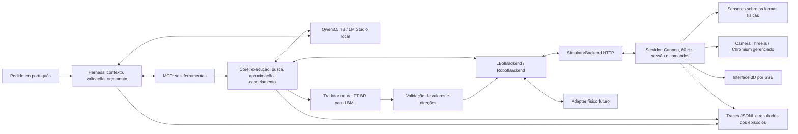

# Harness e simulador com Qwen3.5 4B local

## O que mudou

O servidor é a autoridade da simulação. A interface 3D acompanha o estado por SSE; abrir ou fechar abas não inicia, interrompe ou duplica a física. O Qwen seleciona ferramentas e objetivos. O core executa habilidades limitadas, confere sensores e aguarda resultados reais dos comandos.

O modelo especializado PT-BR → LBML foi preservado. `move` traduz frases concretas, compara a tradução com os valores e direções pedidos e rejeita divergências. Habilidades internas emitem LBML estruturado diretamente. Não há correção silenciosa de uma tradução divergente.



## Executar na máquina local

No LM Studio, mantenha carregado o modelo **Qwen3.5 4B**, identificado como `qwen3.5-4b`, GGUF **Q4_K_S**, com visão habilitada e contexto **8.192**. Habilite o servidor em `http://127.0.0.1:1234`.

Terminal do simulador:

```sh
cd 3.controlador/lbot-simulator-web
npm ci
npm run setup:camera
npm run build
npm run start
```

Terminal do harness:

```sh
cd 3.controlador/lbot-mcp
uv sync --extra dev
uv run lbot-harness
```

A interface fica em `http://127.0.0.1:3001`. O harness usa essa API por padrão. `.env.example` documenta as variáveis; exporte-as no terminal, pois o arquivo não é carregado automaticamente. `/exit` encerra o CLI; `Ctrl+C` interrompe o episódio e solicita parada ao backend.

A inicialização testa uma chamada de ferramenta fictícia, a continuação após seu resultado e a interpretação de uma imagem. Nenhum teste de compatibilidade movimenta o robô. Neste runtime, `reasoning_effort=none` efetivamente desativou raciocínio; o parâmetro `chat_template_kwargs.enable_thinking=false` não teve esse efeito na medição inicial. O preflight recusa um runtime incompatível.

## Contratos e responsabilidades

| Ferramenta | Responsabilidade |
|---|---|
| `camera()` | PNG frontal atual, identificação, sessão, revisão, instante e intrínsecos. Não fornece pose absoluta. |
| `proximity()` | Distâncias em centímetros, validade por sensor e identificação temporal da leitura. |
| `move(command)` | Tradução neural, validação, movimentos segmentados e conclusão confirmada. |
| `search_object(description)` | Busca limitada; retorna detecção e cobertura realizada, sem aproximação final. |
| `approach(target, description?, stop_distance_cm=50)` | Busca/alinhamento e aproximação verificada de objeto; ou aproximação do obstáculo frontal medido. |
| `stop()` | Cancela habilidade, interrompe o backend e informa se a parada foi confirmada. |

`front_obstacle` não significa “parede”. Detecção, centralização e chegada são resultados distintos. Falha de inferência permanece erro; não é transformada em ausência de objeto. `detected=false` significa que o alvo não foi localizado na busca realizada.

A busca tenta oito observações em passos de 45° e, se necessário, explora quatro direções com deslocamentos de até 50 cm, segmentados em até 20 cm. O orçamento de busca é 150 s, dentro do limite de habilidade de 180 s. Uma busca interrompida pelo próprio orçamento informa `coverage.search_complete=false`, observações realizadas e `limit_reason=time_budget`. O retorno restaura o rumo do avanço antes de recuar; o término de uma busca negativa também restaura o rumo inicial. Isso usa rotação relativa confirmada, sem coordenadas privilegiadas.

A aproximação usa 50 cm por padrão, tolerância de ±5 cm e margem mínima de 20 cm. Um obstáculo frontal já dentro dessa margem impede iniciar a busca de aproximação. O alvo perdido provoca parada e até duas tentativas de recuperação por observação/rotação. Não há avanço cego nem planejador de desvios.

OpenCV propõe regiões por cor e acompanha uma região selecionada semanticamente. O Qwen recebe a imagem e ampliações das regiões para identificar o alvo; uma classificação rígida de contorno não veta todas as detecções. A atribuição da distância frontal ao alvo exige associação com sua região visual e, quando disponível, a calibração câmera–sensor.

## Execução, física e observações

Cada comando tem `command_id`, `session_id` e estado `accepted`, `running`, `completed`, `blocked` ou `cancelled`. Os contratos também representam `failed` e `timed_out` no adapter/core. `accepted` não é conclusão. O adapter consulta o registro até o estado terminal; o intervalo de polling não estima a duração do movimento.

O mesmo identificador e comando não executa novamente. Identificador conflitante, sessão antiga e concorrência são rejeitados. Parada e reset têm prioridade. O reset cancela comandos ativos e cria outra sessão. Habilidades vinculam movimentos à sessão observada, inclusive se ocorrer reset entre uma captura e o próximo comando. Uma resposta de execução perdida produz `execution_unknown`, parada por melhor esforço e nenhum reenvio automático de movimento.

Cannon trabalha em metros/segundos com passos fixos de 60 Hz. A fronteira LBML/API usa centímetros/graus. Orientação zero aponta para +Z; esquerda aumenta a rotação, direita diminui. A rotação é acumulada, permitindo giros de 360°. `D20L;` significa girar 90° à esquerda e avançar 20 cm. Progresso, colisão e ausência de progresso determinam a conclusão; toda saída limpa velocidades.

A câmera é renderizada em Chromium/Three.js sem aba do usuário. Cena, obstáculos e parâmetros de câmera são compartilhados. Falha retorna `camera_unavailable`, sem mapa 2D nem imagem preta artificial. Sensores usam as formas físicas do mesmo mundo. O adapter rejeita imagens de sessão antiga ou anteriores à última execução acompanhada. A UI exibe os metadados e retira imagens que se tornaram indisponíveis.

`/api/state` e o endpoint opcional de cenários são diagnósticos. Seus valores de pose e identidade de objetos são usados pelo avaliador, nunca pelo Qwen como percepção.

## Limites, registros e reprodução

Inferência: 60 s; habilidade: 180 s; busca: 150 s; episódio: 300 s. Controle usa temperatura 0,2 e até 768 tokens de saída; percepção estruturada usa temperatura zero. Há serialização das inferências de cada cliente e execução sequencial entre decisões do harness e percepção das habilidades. As solicitações ao modelo têm retry automático desabilitado.

O contexto conserva no máximo duas imagens recentes, compacta interações completas e preserva os pares de chamada/resultado. A reserva usa uma estimativa conservadora por texto/imagem; não é um tokenizador exato do Qwen. Pedidos acima do orçamento são rejeitados. Os tokens efetivamente utilizados estão nos registros de inferência.

Nomes e argumentos são validados antes da chamada. Uma chamada inválida permite correção; erros operacionais encerram o episódio. Se uma resposta trouxer várias chamadas, todos os resultados são respondidos antes de anexar imagens. Falha anterior impede executar os movimentos seguintes da mesma resposta. `busy` não solicita parada de outra operação.

Os logs `runs/*.jsonl` registram inferências, operações, decisões e comandos identificados. `LBOT_TRACE_DIR` pode reunir logs das duas aplicações no mesmo diretório. Pixels e credenciais não são gravados. As respostas efetivas das ferramentas aparecem separadas da narrativa do modelo.

Verificações:

```sh
cd 3.controlador/lbot-simulator-web
npm run check
npm test

cd ../lbot-mcp
uv run pytest -q
uv run mypy src
uv run ruff check src tests evals
```

Os testes incluem movimentos, giros completos, rotação perto de parede, colisão parcial, duplicatas, concorrência, reset, sessão antiga, câmera sem aba e sem Chromium, sensores inválidos, perda de resposta, cancelamento de inferência/busca e fechamento de duas abas durante movimento. Dois backends falsos permitem testar atraso, indisponibilidade e odometria relativa sem pose absoluta pública.

Para avaliação real, inicie **outra instância**, exclusiva, em produção:

```sh
PORT=3003 LBOT_ENABLE_EVAL=1 npm run start
```

No diretório MCP:

```sh
PYTHONPATH=src uv run python evals/run.py --split development --output development
PYTHONPATH=src uv run python evals/run.py --split acceptance --output acceptance-final
PYTHONPATH=src uv run python evals/run.py --cases evals/stress-cases.json --output stress
```

`evals/cases.json` contém 60 pedidos em seis categorias, divididos em 30 de desenvolvimento e 30 originalmente reservados. Cenas, posições, alvos ausentes e bloqueios variam. Rótulos não são enviados ao modelo. A avaliação verifica pose final, rotação acumulada, distâncias, resultado da busca e retorno à origem, além da escolha de ferramentas. O conjunto adicional inclui esfera, cone, alvo parcialmente visível e oclusão do feixe.

## Resultados e limites de validade

Os resultados finais e o histórico de falhas estão no relatório [evals/RESULTADOS_IMPLEMENTACAO.md](lbot-mcp/evals/RESULTADOS_IMPLEMENTACAO.md). Os testes comprovam os cenários executados; não estabelecem probabilidades de sucesso para qualquer ambiente físico ou pedido livre.

A primeira aceitação identificou duas buscas que esgotaram o tempo e uma aproximação que explorou apesar de um bloqueio frontal próximo. A correção do orçamento também exigiu restaurar a orientação antes do retorno. Os dados dessas execuções continuam em `acceptance/` e `acceptance-budget/`. As reavaliações são regressão sobre cenários conhecidos; não devem ser apresentadas na dissertação como uma nova amostra independente.

A física ainda é idealizada: velocidade comandada, chassi representado por caixa e obstáculos estáticos. Não modela escorregamento, dinâmica completa de rodas, ruído ou calibração de um robô real. A avaliação semântica é pequena; múltiplos objetos parecidos, mesma cor, iluminação variável e oclusões complexas exigem experimentos adicionais. Energia, temperatura e utilização da GPU não foram medidas.

## Adapter físico futuro

Implemente `LBotBackend` com captura, sensores, capacidades, execução LBML acompanhada e parada. Normalize unidades e parâmetros da câmera no adapter; a implementação atual usa PNG VGA. Forneça sessão/revisão de observação e progresso medido (`distance_cm`, `rotation_degrees`) nos resultados dos comandos. `execute_lbml(..., session_id=...)` precisa rejeitar uma sessão obsoleta antes de acionar motores.

A conclusão no hardware deve vir de encoders/controlador, com cancelamento e watchdog próprios. Uma espera calculada a partir da distância não substitui essa confirmação. A calibração deve descrever origem/direção do sensor no referencial óptico e intrínsecos reais. Transformações entre unidades ou resolução pertencem ao adapter.

Harness, contratos MCP, tradutor e habilidades podem ser mantidos. Será necessário implementar a fábrica do backend físico em `mcp_server/server.py`, configurar transporte e executar os mesmos testes de contrato. O adapter físico, navegação com desvios e execução em Raspberry Pi permanecem trabalhos futuros.
