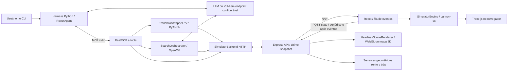
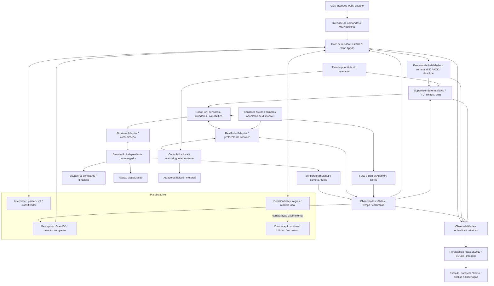

# Relatório de Análise do Projeto de Mestrado

**Data:** 26 de setembro de 2026. **Referência Git:** `007754c`, com alterações locais preexistentes. **Escopo:** todo o repositório, com aprofundamento no controlador atual em `3.controlador/`. **Natureza:** análise técnica e acadêmica; nenhuma alteração de código foi realizada.

### Método e limites da análise

Foram inspecionados a estrutura, READMEs, código Python, TypeScript e Java dos principais fluxos, configurações e dependências, testes, geradores de datasets, células de código dos notebooks de treinamento, benchmark histórico, scripts e documentação local. Bibliotecas instaladas e arquivos de lock foram considerados como infraestrutura, não como implementação autoral. Os grandes datasets foram examinados programaticamente, sem confundir linhas de texto com exemplos de treinamento.

A análise distingue **observação** (código ou verificação local), **inferência** (consequência provável que ainda exige experimento) e **proposta** (funcionalidade futura). Comentários, prompts e documentos do repositório foram tratados como material de análise, não como instruções para executar ações. A documentação exportada em `bridge/trusted-read-02/document-text.md` descreve um resumo de trabalho, não demonstra resultados experimentais.

Na abertura, já havia modificação em `.DS_Store`, exclusão local de `3.controlador/lbot-mcp/src/mcp_server/services/go_to_orchestrator.py` e diretório `bridge/` não rastreado. Esses estados foram preservados. A ausência atual de componentes de `go_to` é relatada como condição do checkout analisado, sem atribuir a exclusão a um defeito histórico ou a esta análise.

Foram executadas verificações sem instalação de dependências, sem treinamento, sem gerar builds e sem iniciar comandos no robô ou contratar APIs. Os testes Python usaram `PYTHONDONTWRITEBYTECODE=1` e `-p no:cacheprovider`. Não foram executados o sistema completo com LM Studio, a coleta com PostgreSQL, os testes Angular/Java nem ensaios em hardware embarcado. Portanto, este relatório não certifica operação ponta a ponta nem desempenho físico.

As fontes externas são primárias — documentação dos fabricantes, projetos oficiais e artigos dos autores — consultadas nesta data. Especificações e disponibilidade podem mudar. Recomendações de desempenho são hipóteses a medir, salvo quando identificadas como resultados locais.

## 1. Resumo executivo

O projeto tem uma base concreta para uma dissertação em Computação Aplicada: interface em português, linguagem intermediária de movimentos, modelo neural pequeno, ambiente de simulação, ferramentas de observação e uma primeira abstração de backend. A pergunta central mais promissora é **como executar tarefas robóticas delimitadas por linguagem natural, localmente e sob restrições de recursos, preservando correção semântica, verificação de execução e robustez na transferência para o mundo físico**.

O estado atual é de **protótipo de pesquisa integrado parcialmente**, não de módulo embarcado pronto. Há três linhas de desenvolvimento: coleta de dados com Angular/Spring Boot, tradutores neurais versionados e controlador Python/MCP com simulador React. Elas compartilham LBML, mas não formam uma cadeia científica completamente rastreável entre dados humanos, treinamento e tarefas físicas.

Os bloqueios mais importantes são:

1. Movimento aceito pela API é apresentado como executado sem confirmação individual de conclusão; espera por tempo não substitui feedback.
2. Há decisões inseguras diante de falha de sensores e recuperação visual com avanço sem checagem de proximidade.
3. A validade sintática de LBML não garante fidelidade ao pedido. O V7 local transformou uma negação em movimento afirmativo.
4. A reconstrução do split do notebook V7 revelou exemplos idênticos em treino e teste; o benchmark histórico também contém erro de apresentação.
5. O simulador depende do navegador para a física e usa sensores ideais e uma câmera separada, com possibilidade de fallback incompatível com a busca.

**Direção recomendada:** estabilizar um core de execução verificável e um supervisor determinístico; manter o V7 como baseline local; comparar parser determinístico, modelo compacto e decisão estruturada; executar uma tarefa delimitada de busca e aproximação de objetos em arena. Começar com Raspberry Pi 5 e medir antes de acrescentar acelerador. Jetson é alternativa se visão neural ou VLM forem indispensáveis. Jev faz sentido como comparação de decisão remota; a oferta pública consultada não demonstra inferência offline no robô.

## 2. Entendimento do projeto

### 2.1 Objetivo e problema real

O sistema busca permitir que uma pessoa controle um robô móvel educacional por comandos em português, sem escrever diretamente instruções de movimento. Há dois níveis diferentes de tarefa: tradução de pedidos explícitos, como “ande 30 cm para frente”, e execução de objetivos que precisam de observação e realimentação, como encontrar um cubo vermelho e aproximar-se dele.

O problema envolve interpretação linguística, correspondência entre linguagem e ações possíveis, percepção, coordenação de movimentos e verificação do efeito obtido. O requisito futuro de execução embarcada acrescenta restrições de energia, memória, latência e disponibilidade de rede.

O README chama o robô de E-Puck, enquanto o prompt do harness o descreve como L-Bot educacional da UDESC. Não encontrei especificação técnica suficiente para concluir qual variante física, firmware, câmera, sensores, protocolo e capacidade de carga serão usados. A existência do robô físico é informação fornecida pelo pesquisador; sua interface operacional ainda não está demonstrada neste checkout.

### 2.2 Organização observada

| Área | Implementação encontrada | Papel efetivo e limite |
|---|---|---|
| `1.coleta-de-dados/lbot-datagen/` | Angular 20, Three.js, cannon-es; Spring Boot 3.5.3, Java 17, Spring AI e PostgreSQL/JPA | Interação, jogo, controle virtual, registro de mensagens e avaliações; usa modelos externos para normalização e tradução |
| `2.treinamento-de-modelo/lbot-natural-language-controller/` | Python/PyTorch, versões v3–v7, notebooks, geradores sintéticos, benchmark e artefatos locais | Pesquisa de tradução português → comandos; evolução de GPT causal para encoder-decoder com GRU |
| `3.controlador/lbot-mcp/` | FastMCP, SDK OpenAI, httpx, PyTorch e OpenCV | Agente CLI, ferramentas de câmera/proximidade/movimento/busca; adapta HTTP do simulador |
| `3.controlador/lbot-simulator-web/` | React 19, Vite, TypeScript, Express, SSE, Three.js, cannon-es, `gl` e pngjs | Física no navegador; API e renderização de câmera no processo Node |
| `bridge/` | Exportação local de documento | Contexto documental complementar; não é componente do controlador |
| `scripts/sdd-loop.sh` e `.opencode/` | Apoio ao fluxo de desenvolvimento | Não constituem execução robótica nem experimento científico |

O README agrega tecnologias históricas como Enki, CMake e sockets TCP. Não encontrei implementação C++/CMake de simulador Enki no código atual listado. Existe uma classe Java de comunicação TCP, mas seu `@Service` está comentado. Também há uma antiga API FastAPI em v3; ela não é o endpoint usado pelo backend atual do MCP.

### 2.3 Fluxo atual do controlador

1. `harness/cli.py` lê uma solicitação e cria/usa `ReActAgent`.
2. `harness/mcp_client.py` inicia o servidor MCP como subprocesso stdio.
3. O agente descobre ferramentas e consulta um endpoint compatível com o SDK OpenAI, por padrão LM Studio em `127.0.0.1:1234/v1`. O modelo é configurado por ambiente; `auto` não identifica de forma reprodutível os pesos utilizados.
4. O LLM decide responder ou chamar ferramentas. Câmeras são inseridas como imagens no histórico; proximidade retorna texto.
5. A ferramenta `move` usa `TranslatorWrapper`, que carrega o V7 de outro diretório do repositório e traduz português para LBML.
6. `SimulatorBackend` envia LBML por HTTP ao Express em `localhost:3001`.
7. Express publica evento SSE para uma única aba ativa. React enfileira o evento e o `SimulatorEngine` executa a sequência.
8. React envia snapshots ao servidor ao conectar, ao concluir eventos e periodicamente a cada dois segundos. A API de câmera reconstrói uma cena a partir desse último snapshot; a de proximidade calcula distâncias geometricamente.

`search_object` segue um segundo fluxo: consulta um LLM visual, confirma candidatos com OpenCV, centraliza, explora e aproxima usando comandos LBML diretamente. Essa ferramenta não depende do tradutor V7 para gerar seus movimentos.

### 2.4 O que está implementado e o que permanece experimental

**Implementado no código:** gramática LBML; movimentos relativos; ferramentas MCP; comunicação HTTP/SSE; snapshots; tradutor V7 carregável localmente; detecção heurística de cubos/esferas/cones e cores; busca com varredura e exploração em estrela; testes unitários de parte desse fluxo; coleta persistida em JPA.

**Experimental ou incompleto:** percepção baseada em concordância LLM/OpenCV; navegação por heurísticas; temporização fixa; pressupostos geométricos; integração entre coleta real e treinamento; controle de execução/cancelamento; validação de generalização; execução embarcada; adaptação ao firmware real. Há referências a `go_to` no harness e nos testes, mas ele não está registrado no servidor atual e os módulos esperados estão ausentes.

**Não demonstrado:** SLAM, localização física, odometria integrada, planejamento de navegação autônoma com mapa, drivers de sensores reais, comando de motores, watchdog independente, exportação ONNX/TFLite, métricas de energia, sim-to-real ou ensaios do modelo agêntico em Raspberry Pi.

## 3. Arquitetura atual

### 3.1 Diagrama do caminho ativo



A coleta Angular/Spring e os notebooks são caminhos separados desse diagrama. PostgreSQL não é a persistência experimental do harness atual.

### 3.2 Decisões arquiteturais já tomadas

- LBML como representação intermediária: deslocamento `D<cm><F|B|L|R>;` e rotação `R<graus><L|R>;`.
- MCP para expor habilidades ao agente, com transporte stdio local.
- Separação inicial entre backend abstrato e backend do simulador.
- Uso de endpoint configurável de inferência, favorecendo troca do serviço de linguagem.
- Física e apresentação executadas juntas no browser, comandadas por eventos do servidor.
- Um único cliente ativo; nova aba substitui a anterior.
- Percepção híbrida: semântica por VLM, geometria/cor por OpenCV.
- Tradutor especialista pequeno, em vez de delegar toda tradução ao LLM geral.

### 3.3 Avaliação de engenharia

**Separação de responsabilidades:** boa direção em `backends/`, `tools/`, `services/` e `harness/`. Contudo, o core de tarefa, a política de segurança, o protocolo de execução e a percepção ainda se misturam no `SearchOrchestrator`. O servidor importa tools para registrar efeitos globais, e `context.py` mantém backend global.

**Modularidade/acoplamento:** `LBotBackend` é uma porta útil, mas expõe dicionários sem contratos fortes e pressupõe dois sensores em centímetros com alcance de 400. `TranslatorWrapper` depende da topologia de diretórios, altera `sys.path` e faz remendo temporário em `__main__` para carregar classes serializadas. Um pacote instalado fora do repositório não contém automaticamente modelo, pré-processador e vocabulários necessários.

**Coesão:** o simulador React tem componentes e módulos distinguíveis. A repetição de cena entre browser e Node, os parsers LBML em Python/TypeScript/Angular e o pré-processamento duplicado entre notebook e runtime aumentam risco de divergência.

**Concorrência:** o agente serializa tool calls e a UI tem fila por promises; isso ajuda o caminho nominal. Ainda assim, chamadas síncronas do SDK OpenAI dentro de funções assíncronas bloqueiam o event loop. A API não arbitra comandos por missão, não limita adequadamente backlog e não associa respostas a conclusão individual. Reset e disconnect entram na mesma fila de execução.

**Erros:** há captura de exceções, mensagens ao usuário, limites de tentativas e timeouts HTTP. Porém, erros visuais viram ausência de objeto, sensor indisponível pode virar caminho livre, e as tools misturam JSON, texto e mensagens de erro. Essa mistura dificulta distinguir falha, rejeição, interrupção e sucesso.

**Configuração:** existem `LBOT_BACKEND`, `LBOT_SIMULATOR_URL`, `LBOT_LLM_URL`, chave e modelo, além de `PORT`. Faltam perfis versionados de experimento, modelo explícito, capabilities do dispositivo, limites físicos e calibração. Os READMEs discordam sobre Node/Python; o `pyproject` aceita Python >=3.10, embora o procedimento indique 3.12.

**Observabilidade:** callbacks do agente e logs são bons pontos de extensão. Não há trilha persistente e correlacionada de missão, command ID, observação, modelo, timestamps, resultado físico e consumo. Logs do orchestrator usam `print` em stderr; o tradutor imprime em stdout ao carregar, inadequado ao subprocesso MCP stdio.

**Testabilidade/manutenção:** existem mocks úteis e testes de detector; faltam testes de contrato, comportamento temporal real e browser/API. O servidor web passa na checagem TypeScript, mas não há script `test` apesar do README. Não encontrei workflows de CI do projeto; `.github/modernize` contém hooks auxiliares, não pipeline de testes.

**Substituição do simulador:** viável em conceito, insuficiente em contrato. Acrescentar `RealRobotBackend` sozinho não resolve conclusão, estado desatualizado, calibração, tempo de execução, limites, cancelamento e falhas. Esses elementos precisam entrar no contrato do core.

## 4. Pontos fortes

1. **Problema aplicado e cenário concreto.** Há intenção de integração com plataforma física existente e foco em interação em português.
2. **Representação intermediária simples.** LBML torna ações inspecionáveis e permite comparação exata, replay e validação sintática.
3. **Modelo especialista compacto.** O V7 local tem 3.163.284 parâmetros e checkpoint de aproximadamente 12,08 MiB; é uma base plausível para CPU embarcada.
4. **Primeira separação por adapters.** `LBotBackend` e `SimulatorBackend` já reduzem a dependência direta das tools em Express.
5. **Evolução investigativa registrada.** V5/V5.1/RASA, V6/V7, geradores e notebooks permitem reconstruir escolhas e formular ablações.
6. **Observação antes/depois de ações em parte do fluxo.** Busca e aproximação tentam reavaliar percepção e distância; a intenção de malha fechada é correta, embora a implementação tenha lacunas.
7. **Infraestrutura de coleta humana.** `Message`, avaliações e `VirtualControlSession` podem apoiar corpus supervisionado; isso ainda precisa de curadoria e proveniência.
8. **Testes existentes com execução rápida.** Os 72 testes selecionados dos componentes presentes passaram no ambiente atual.

## 5. Pontos fracos

| Problema | Impacto | Sugestão | Prioridade |
|---|---|---|---|
| Sucesso inferido por aceitação e tempo | Resultados falsos, observação prematura e risco físico | Confirmação de conclusão por command ID e estado final verificado | Crítica |
| Falha sensorial permite movimento | Robô pode avançar sem evidência de segurança | Supervisor independente; falha ou leitura vencida interrompem movimento | Crítica |
| Tradução só validada por regex | Ação sintaticamente válida pode contrariar o usuário | Preservar números/negação, rejeitar fora de domínio e validar plano | Crítica |
| Split com pares duplicados e famílias sintéticas relacionadas | Acurácia otimista e contribuição científica frágil | Deduplicar e separar por origem/template/participante antes de augmentation | Alta |
| Browser participa do controle temporal | Resultados dependem de FPS, aba e máquina | Execução da simulação independente da visualização | Alta |
| Não há driver/contrato físico comprovado | Hardware e sim-to-real podem inviabilizar cronograma | Levantar firmware, interfaces e ensaio mínimo cedo | Alta |
| Uso de VLM obrigatório antes de OpenCV | Custo e latência potencialmente evitáveis; recall limitado pelo gate | Medir CV direto e visão neural compacta; VLM apenas sob incerteza | Alta |
| Documentação e funcionalidades divergentes | Reprodução difícil e expectativas incorretas | Documentar caminho ativo, legado, artefatos e comandos realmente disponíveis | Média |
| Sem rastreabilidade experimental ponta a ponta | Falhas não são atribuíveis a linguagem/percepção/controle | Registro persistente de episódios e versões | Alta |
| Escopo cobre muitos problemas simultâneos | Pesquisa se transforma em integração interminável | Escolher tarefa, hipótese principal e conjunto mínimo de comparações | Alta |

## 6. Problemas técnicos encontrados

### 6.1 Execução nominal não equivale a execução comprovada — Crítica

**Evidência:** `SimulatorBackend.execute_lbml()` recebe `accepted`, eventualmente dorme e retorna `status: executado`. `server/index.ts` confirma publicação SSE, sem command ID ou resultado individual. `tools/movement.py` informa “Comando executado”.

**Problema → Impacto → Sugestão:** aceitar envio não demonstra deslocamento, rejeição da engine, colisão ou término → falhas podem ser contadas como sucesso → criar lifecycle `accepted/running/completed/failed/cancelled`, resultado final e timeout por ação. Comparar estado observado com tolerância de posição/orientação.

### 6.2 Atrasos incompatíveis entre caminhos — Alta

`SearchOrchestrator._move_forward/_move_backward/_rotate` usam `execute_lbml()` sem `wait=True` e dormem dois segundos. Na engine, 100 cm demandam nominalmente cinco segundos. A busca pode observar durante a execução ou enfileirar outros movimentos. A API usa snapshots periódicos de dois segundos, sem verificar idade.

O cálculo Python em `lbml.py` omite a rotação de 90° necessária a `D...L/R`; a engine também dorme 300 ms após o último comando, enquanto o estimador considera apenas N−1 intervalos. Em movimento curto, a margem de 10% não cobre essa diferença. A fila pode acrescentar atraso arbitrário.

Há ainda incompatibilidade numérica em `_star_explore()`: `safe_advance` pode ser fracionário quando limitado por uma leitura, mas `_move_forward()` interpola esse valor diretamente em LBML. Um resultado como `D20.5F;` é rejeitado pela gramática de inteiros. Arredondamento/unidades precisam de regra explícita, com conservação da margem de segurança.

**Sugestão:** aguardar eventos reais; temporização nominal fica apenas como deadline e mecanismo de diagnóstico. Incluir captura sincronizada à execução concluída.

### 6.3 Falhas de sensores e recuperação visual — Crítica

`_star_explore()` transforma exceção de proximidade em `distance_frente = 999`, com comentário de caminho livre. `_retry_detect_with_advance()` avança 50 cm e depois 30 cm sem consultar proximidade. Recuos não verificam o sensor traseiro. `_approach()` continua quando a câmera falha.

**Impacto:** falha reduz informação e simultaneamente permite agir; exatamente a condição que precisa limitar movimento no mundo real. **Sugestão:** política de parada sobre falha/idade, proteção frontal e traseira, limites por primitive e recuperação sem avanço cego.

### 6.4 Cancelamento não é parada física — Crítica

`ReActAgent.cancel()` marca um booleano consultado entre passos. Não cancela uma requisição síncrona nem uma tool longa, não envia `stop` ao backend e não existe tal operação em `LBotBackend`. `max_steps=50` limita iterações externas, não duração de uma busca inteira.

Na UI, reset/disconnect são enfileirados atrás do comando ativo. `SimulatorEngine.reset()` elimina `activeAnimation` sem resolver a promise anterior: se chamado durante animação por outro caminho, pode deixar executor pendente. Alguns retornos de falha de sequência não limpam `isAnimating`. São riscos deduzidos do fluxo, não ensaios de browser reproduzidos nesta análise.

**Sugestão:** canal prioritário de stop, cancel token propagado, limpeza em `finally`, resolução de promises, deadline de missão e watchdog no controlador físico.

### 6.5 Semântica linguística perigosa — Crítica

**Verificação local, sem enviar comandos ao simulador:**

| Entrada | Saída V7 |
|---|---|
| `ande 30 cm para frente` | `D30F;` |
| `vire 90 graus para a direita` | `R90R;` |
| `ande 15 cm para frente, depois vire 180 graus para a direita` | `D15F;R180R;` |
| `ande 2 metros para frente` | `D200F;` |
| `não ande 30 cm para frente` | `D30F;` |
| `ande 1 km para frente` | `D999F;` |
| `pare` | `TranslationError` |

Um caso negativo basta para demonstrar que regex não oferece proteção semântica; não permite estimar a frequência do erro. O clamp de 999 cm é explícito em `_convert_units/_clamp_values`, mas altera silenciosamente o pedido. “Passos” usa fator fixo de 75 cm sem significado calibrado ao robô.

**Sugestão:** tratar stop fora do modelo; extrair valores e unidades deterministicamente; preservar proveniência dos argumentos; rejeitar ou esclarecer limites, ambiguidade e negação. Não limpar saída gerada até ela parecer válida como substituto da validação semântica.

### 6.6 Integridade do experimento de tradução — Alta

Contagem de pares `Entrada/Saída` no material presente:

| Dataset | Pares totais | Pares distintos, antes de normalização adicional |
|---|---:|---:|
| V3 | 143.376 | 143.376 |
| V4 | 165.000 | 78.161 |
| V5 | 40.000 | 11.290 |
| V6 | 80.000 | 43.715 |
| V7 | 235.000 | 185.983 |

O notebook V7 carrega entradas em minúsculas, embaralha índices com seed 42 e divide 85/10/5 por exemplo. Reproduzindo esse procedimento no dataset atual, **7.578 de 23.500 exemplos de validação (32,25%) e 3.750 de 11.750 de teste (31,91%) também ocorrem literalmente no treino**, com mesmo par entrada/saída. Não é uma suposição genérica de leakage: a sobreposição foi computada. Isso não prova que o checkpoint presente foi treinado exatamente com esse arquivo; falta vinculação por hash. Demonstra que o procedimento atual, aplicado aos dados atuais, produz teste contaminado.

Mesmo após deduplicação literal, variações da mesma frase base podem cruzar splits. Separar grupos antes de augmentation e guardar identificador do exemplo original. Teste humano externo deve ser independente dos templates e do desenvolvimento.

### 6.7 Benchmark histórico com erro de apresentação — Alta

`benchmark_results.md` reporta V5 209/342 e V5.1 214/342: diferença de **1,46 ponto percentual**, e tempos médios de 500,17/688,67 ms. São números históricos documentados, não reproduzidos nesta análise nem transferíveis para Pi.

Em `benchmark_v5_vs_v5-1.py::generate_markdown_report`, exemplos de melhoria usam a predição V5.1 também na coluna V5 e o esperado na coluna V5.1. Isso explica linhas que mostram ambas iguais enquanto alegam melhoria. Os 91 “disagreements” comparam textos; os 1/6 casos comparam acerto, logo esses números não têm necessariamente de somar 91.

Com apenas sete pares de discordância de acerto (1 contra 6), um McNemar binomial exato bicaudal, se esses agregados estiverem corretos, produz aproximadamente p=0,125. O ganho isolado não sustenta superioridade estatística a 5%. Falta avaliar seeds de treino e variância. Medição histórica usa `time.time()` e seleção automática de device, sem protocolo suficiente de warmup/sincronização CUDA.

**Sugestão:** corrigir relatório a partir dos resultados individuais, preservar JSON bruto, usar teste pareado, intervalos e repetição controlada. Verificar também inconsistências de tamanho de modelos entre READMEs e `RASA_FINAL_REPORT.md` por contagem real de parâmetros.

### 6.8 Câmera não representa sempre o mesmo sensor — Alta

`HeadlessSceneRenderer` constrói outra cena. Paredes headless têm altura 15, enquanto `PHYSICAL_WALLS` define 30. Há diferenças de luz e materiais em relação à visualização/preview. O fallback `render2DScene()` produz vista superior com chão, paredes e robô, **sem desenhar `ARENA_OBJECTS`**. A busca, entretanto, assume imagem frontal e interpreta erro horizontal por FOV.

**Impacto:** fallback pode manter API aparentemente disponível e inviabilizar detecção; resultados variam com suporte nativo a `gl`. **Sugestão:** nunca usar mapa como câmera; declarar capability indisponível, unificar modelo de cena e registrar modo de renderização em cada episódio.

### 6.9 Estado ideal, desatualizado ou ausente — Alta

`/api/camera` e `/api/sensors` usam posição zero quando não há snapshot. Sensores retornam `connected: true` sem exigir cliente ativo e podem usar estado de aba anterior. `pendingEvents` é zerado em qualquer atualização de estado; não representa tamanho real da fila nem conclusão.

O backend de sensor preenche chaves ausentes com 400; a interface precisa distinguir leitura válida no máximo, leitura inválida e sensor indisponível. **Sugestão:** timestamps de captura e recepção, TTL, sequência, identificação de sessão e status explícito de validade.

### 6.10 Física e unidades pouco calibradas — Alta

`engine.step()` chama `world.step(1/60)` a cada `requestAnimationFrame`, enquanto duração usa `performance.now()`. Se FPS variar, física e relógio de comando avançam em ritmos diferentes. Há ajustes artificiais de Y, orientação imposta e curva de velocidade, não modelo de motores/rodas. A arena é interpretada em centímetros, mas gravidade/massa não possuem convenção dimensional documentada. Cones usam caixa na colisão; sensores usam AABB até para esferas.

**Sugestão:** contrato de unidades SI no core, escala documentada no adapter, timestep com acumulador, cinemática diferencial, limites/atrito identificados e teste de sensibilidade. O simulador pode continuar útil como ambiente lógico; não deve ser descrito como digital twin validado.

### 6.11 Visão heurística e identidade do alvo — Alta

`detector.py` busca quatro vértices para cubo, três para cone e círculos de Hough para esfera. Silhuetas 3D variam com perspectiva/oclusão. Selecionar maior área pode trocar identidade entre objetos iguais. `parse_description()` converte desconhecidos em cubo. A tentativa com imagem equalizada em cinza reaplica máscara HSV com saturação mínima 100; para alvos com cor, essa recuperação tende a excluir toda imagem cinza.

`decode_frame()` troca imagem de dimensão diferente de 640×480 por quadro preto. Não reescala nem sinaliza erro. `_star_explore()` consulta LLM sobre uma segunda captura, mas OpenCV sobre a primeira. Proximidade frontal mede o obstáculo mais próximo, não necessariamente o alvo visto: a condição de sucesso pode combinar objeto ao fundo com obstáculo próximo.

**Sugestão:** uma observação única por decisão, erro explícito, câmera calibrada, tracking de instância, medida associada ao alvo e rejeição de classe desconhecida. Calcular bearing pelo modelo pinhole, em vez de proporção linear de pixels com FOV fixo.

### 6.12 Gate visual textual e bloqueio assíncrono — Alta

`vision.py` chama cliente síncrono em `async def` e aceita `"SIM" in answer`. Uma reprodução com respostas locais mostrou `NAO, não vejo nada similar` sendo interpretado como verdadeiro, porque “SIMILAR” contém “SIM”. Também `Não posso afirmar SIM` vira verdadeiro. O prompt limita saída, mas não garante esse contrato.

**Sugestão:** resposta tipada/parse exato, distinguir erro de inferência de ausência, usar cliente assíncrono e timeout explícito. O mesmo bloqueio ocorre em `ReActAgent.run()`; inferência PyTorch/OpenCV também deve sair do loop responsável por cancelamento e I/O.

### 6.13 Empacotamento, protocolo e dependências — Média/Alta

O checkpoint V7 existe **localmente**, mas `.gitignore` ignora `*.pt`/`*.gguf`; clone limpo não o recebe. O carregamento imprime oito linhas em stdout, confirmado localmente, embora stdio seja o canal MCP. Usa `torch.load(weights_only=False)` e classes no pickle com remendo em `__main__`; aceitar arquivos não confiáveis seria perigoso e a distribuição é frágil.

**Sugestão:** pacote de modelo com hash, licença, configuração JSON, vocabulários, state dict/formato apropriado, pré-processador versionado e logs em stderr. Fechar clientes HTTP/LLM no lifecycle e escolher versões de dependências em perfil reprodutível. Limitar tamanho de input, número de comandos, distâncias, rotações e payloads.

### 6.14 Testes, documentação e produção — Média/Alta

| Verificação feita | Resultado | Alcance |
|---|---|---|
| `npm run check`, simulador | Sucesso | Tipagem frontend e servidor; não exercita WebGL/HTTP |
| `pytest` completo no MCP | Interrompido na coleta: dois erros | Ausência de `mcp_server.tools.go_to` e `services.go_to_orchestrator` |
| Detector, search tool e search orchestrator | 72 passed, 0,88 s | Unitários com imagens artificiais/mocks e sleeps substituídos |
| Carregamento V7 e oito traduções exploratórias | Modelo carregou; resultados na seção 6.5 | Sanidade local, não benchmark |

Ambiente: Apple M4 arm64, macOS 27.0, Python 3.12.11, Node 22.19.0. Traduções dessa amostra levaram aproximadamente 0,75–7,56 ms após carregamento, em CPU; são observações isoladas com comprimentos diferentes, sem protocolo de benchmark e sem equivalência a Raspberry Pi.

Tests da visão frequentemente substituem `ask_llm_if_object_visible`, escondendo comportamento real do parser/SDK. Fixtures usam `AsyncMock` em cliente chamado sincronicamente. Java testa essencialmente carregamento de contexto; Angular contém teste de título padrão. Não foi executada essa suíte externa ao controlador.

O `start` Express não serve `dist` nem define proxy de produção. O README não descreve uma implantação integrada dos assets com a API; o comando `vite preview` é uma opção de inspeção do build, não especificação suficiente dessa implantação. Documentar servidor estático/reverse proxy e ensaio integrado de produção. APIs usam CORS amplo e não autenticam controle; antes de expor na rede do robô, limitar interface/rede e autenticar acesso.

### 6.15 Coleta não é ainda dataset validado — Alta

`MessageService.sendMessage()` normaliza uma vez e chama `processAndExecuteCommand()`, que normaliza novamente. Há duas chamadas de normalização potencialmente inconsistentes, dentro de fluxo transacional. A função com “Execute” no nome apenas retorna LBML; não envia ao robô. `RobotCommunicationService` tem `@Service` desativado e referencia Enki em localhost:9999.

O serviço salva avaliações, mensagens, descrições e comandos virtuais; não encontrei pipeline rastreável de exportação e curadoria ligando esses registros aos datasets sintéticos do V7. `simulator-frame.ts` referencia `/robo-simulator.html`, não encontrado entre os assets inventariados; verificar se esse componente é utilizado antes de tratar a referência como falha ativa.

**Sugestão:** separar geração de rótulo, revisão humana e execução observada; salvar versão do modelo/provedor e origem, chamar normalização uma única vez e fazer ingestão/exportação auditável fora da transação longa de rede.

## 7. Avaliação da proposta de IA

### 7.1 Há três problemas de IA distintos

**Tradução semântica:** transformar linguagem natural em ações/argumentos. **Percepção:** reconhecer e localizar o objeto pedido. **Decisão de tarefa:** escolher a próxima habilidade diante das observações. Controle de motores, comparação de distâncias e validação de protocolo são problemas diferentes, majoritariamente determinísticos neste escopo.

Hoje o agente pode transformar um objetivo em português em movimentos concretos também descritos em português, para o V7 voltar a traduzir para LBML. Essa dupla interpretação cria oportunidades de erro. Proposta: LLM produz plano tipado de habilidades de alto nível; comandos mensuráveis seguem parser ou tradutor especialista uma única vez. O executor gera LBML como formato de adapter, não como texto livre escolhido pelo agente.

### 7.2 Avaliação do V7

O código efetivamente usa **encoder BiGRU de duas camadas, hidden 256, decoder GRU e atenção aditiva Bahdanau**, em nível de caracteres, com vocabulários separados e greedy decoding até 100 tokens. Não é o modelo RASA da versão V5.1 nem um LLM geral pré-treinado. A classificação arquitetural do README geral precisa ser atualizada.

É uma escolha plausível para o domínio pequeno: poucos parâmetros, inferência local e representação de saída curta. A amostra verificada demonstra tradução de comandos simples e compostos, mas também mostra que o domínio aceito não está adequadamente limitado. O modelo não oferece confiança/rejeição calibrada nem garante cópia de números. O wrapper verifica formato, não significado. Input pode conter caracteres desconhecidos e comprimentos fora de treino; `max_enc_len` na configuração não é uma proteção efetiva de comprimento no caminho de inferência.

O decoder recalcula a projeção dos encoder outputs na atenção a cada token e guarda mapas de atenção mesmo quando o consumidor só quer o comando. Há espaço para otimização, mas medir antes de reescrever. A maior limitação atual é validade científica/semântica, não tamanho do checkpoint.

O notebook possui pré-processamento próprio em célula final, distinto do runtime em clamp e normalização. Treino/teste principal carrega texto em minúsculas, enquanto produção aplica transformações adicionais. Essa assimetria deve ser documentada e avaliada em ablação; compartilhar um módulo evita versões divergentes.

### 7.3 Onde usar cada abordagem

| Função | Primeira opção proposta | Justificativa e limite |
|---|---|---|
| STOP, watchdog, limite de velocidade e leitura vencida | Código/controlador determinístico | Não dependem de interpretação probabilística |
| Unidades, números, gramática e limites | Parser determinístico | Preserva valores e facilita auditoria |
| Comando curto com forma conhecida | Gramática + slots; V7 como comparação | É possível resolver parte relevante sem geração neural |
| Intenção e rejeição de pedidos fora de domínio | TF-IDF + regressão logística/SVM, ou encoder pequeno | Baselines locais baratos; avaliar português informal/negação |
| Paráfrase e composição linguística ampla | V7 ou pequeno modelo semântico com saída restrita | Só se houver ganho em teste externo independente |
| Objetos geométricos coloridos em arena | HSV/contornos como baseline | Muito barato; falha em perspectiva, luz e objetos semelhantes |
| Percepção robusta em câmera real | Detector neural compacto de classes delimitadas | Permite treino, quantização e métrica por bounding box |
| Relação aberta entre descrição e cena | VLM opcional sob incerteza | Mais flexível, mas caro; precisa demonstrar benefício |
| Sequência de habilidades e diálogo | Máquina de estados/behavior tree + LLM opcional | Mantém efeitos verificáveis, restringe planejamento aberto |

Para visão neural, avaliar detector leve baseado em backbone MobileNet ou família compacta equivalente com pesos/licença e operadores compatíveis com o hardware escolhido. Não incluir catálogo extenso de modelos como substituto de piloto comparativo. Escolher duas alternativas e medir precisão, recall, latência e energia no cenário real.

Um VLM pode ajudar a interpretar descrição fora das classes fechadas ou resolver dúvida contextual. Não é adequado tratá-lo como requisito para detectar uma esfera azul já suportada por OpenCV. O gate atual só permite confirmação por CV quando o LLM responde sim: o recall do conjunto fica limitado pelo gate e por CV, e não há independência garantida entre erros.

LLMs têm valor em diálogo, decomposição de tarefas e interpretação de instruções novas. Não devem estimar distância por texto, inventar números de percurso, executar laços críticos nem declarar missão concluída sem predicados observáveis. Modelos multimodais/VLA de grande escala seriam outro projeto em termos de dados e recursos; não encontrei política VLA aprendida no repositório. A literatura já investiga grounding de linguagem em habilidades e VLA, portanto integrar um LLM ao robô por si só não estabelece originalidade. Ver [SayCan](https://arxiv.org/abs/2204.01691) e [RT-2](https://arxiv.org/abs/2307.15818).

### 7.4 Pipeline local mínimo recomendado

Texto → tratamento prioritário de parada → interpretação/slots → plano tipado validado → habilidades determinísticas → percepção local → supervisor de segurança → adapter do robô. O V7, o parser e eventual classificador devem ser substituíveis sob o mesmo contrato. Começar com um conjunto fechado de objetivos; pedidos desconhecidos resultam em rejeição explícita ou esclarecimento.

## 8. Viabilidade de Edge AI

### 8.1 Conclusão de viabilidade

**O tradutor V7 é candidato realista a execução em Raspberry Pi; o sistema completo com VLM ainda não foi dimensionado.** O checkpoint local pesa cerca de 12 MiB, mas RAM de processo inclui framework, tensores, buffers e I/O. O custo do LM Studio depende de modelo não identificado no repositório. “Endpoint local” no computador de desenvolvimento não significa inferência a bordo.

Não é necessário levar Angular, Spring Boot, PostgreSQL e renderização do simulador para dentro do robô. Esses componentes podem ficar na estação de desenvolvimento/coleta. O robô deve executar core, sensores, percepção necessária, modelos locais e telemetria compacta.

### 8.2 Hardware: opções e decisão

| Opção | CPU/aceleração e memória | Adequação proposta | Energia, custo e manutenção |
|---|---|---|---|
| Raspberry Pi 5, preferencialmente 8 GB para o piloto | Cortex-A76 quad-core 2,4 GHz, VideoCore VII; versões de RAM até 16 GB; sem CUDA | V7, parser, OpenCV, core e detector pequeno inicialmente em CPU | Ecossistema favorável; cooler ativo e fonte adequada; medir sistema completo antes de presumir baixo consumo |
| Pi 5 + AI HAT+ | Hailo-8L 13 TOPS ou Hailo-8 26 TOPS, INT8 | Detecção visual em modelo suportado e compilado | Custo/energia extras; GRU/VLM não migram automaticamente para NPU |
| Pi 5 + AI HAT+ 2 | Hailo-10H 40 TOPS INT4 e 8 GB próprios | Possibilidade de workloads generativos compatíveis | Alternativa atual a investigar; suporte de modelo e tempo de conversão são riscos |
| Jetson Orin Nano Super 8 GB | CPU Arm, GPU CUDA/Tensor Cores; até 67 TOPS anunciados | Melhor ponto de partida se detector neural e VLM local forem requisito forte | Faixa de potência configurável anunciada de 7–25 W; refrigeração e bateria relevantes; ecossistema NVIDIA reduz algumas barreiras de aceleração |
| Orange Pi 5/5B, 8 ou 16 GB | RK3588S, 4×A76 + 4×A55, Mali-G610 e NPU anunciada de 6 TOPS | Alternativa com CPU/NPU integrada para modelos compatíveis | Avaliar preço entregue e disponibilidade; integração RKNN adiciona trabalho de conversão e dependência de BSP/runtime |
| SBC/mini-PC x86 de baixo consumo | CPU e eventualmente acelerador/GPU integrado | Plataforma de laboratório se o chassis comportar | Pode simplificar ferramentas; maior volume e consumo devem ser medidos |
| Microcontrolador auxiliar | Controle sem modelo grande | Watchdog, motores e parada independente | Complementa o computador Linux; não substitui o computador de inferência do V7/VLM |

Especificações Pi e recomendação de fonte 5 V/5 A/refrigeração: [Raspberry Pi 5](https://www.raspberrypi.com/products/raspberry-pi-5/). A classificação dos HATs, incluindo suporte generativo do HAT+ 2, vem da [documentação oficial dos AI HATs](https://www.raspberrypi.com/documentation/accessories/ai-hat-plus.html). Não comparar seus TOPS INT8/INT4 com TOPS esparsos de outra plataforma como se fossem latência do mesmo modelo.

Jetson tem preço anunciado de referência de US$249, que não representa preço entregue no Brasil, acessórios ou disponibilidade: [NVIDIA, anúncio do Orin Nano Super](https://developer.nvidia.com/blog/?p=93942). A faixa de potência e especificações do kit estão na [página do produto](https://www.nvidia.com/en-sg/autonomous-machines/embedded-systems/jetson-orin/nano-super-developer-kit/). Orange Pi 5B: [especificação do fabricante](https://www.orangepi.org/html/hardWare/computerAndMicrocontrollers/details/Orange-Pi-5B.html).

**Custo deve ser tratado como BOM entregue:** placa + câmera + armazenamento + fonte/regulador + cooler + acelerador + cabos + suporte mecânico + importação. Pi com muitos acessórios pode deixar de ser a solução mais econômica. Não recomendo comprar vários dispositivos antes do piloto nem fixar valores em reais sem cotação. Jetson só é viável a bordo se massa, volume e orçamento energético do robô comportarem o conjunto.

### 8.3 Frameworks e otimização

| Tecnologia | Uso recomendado | Limite específico neste projeto |
|---|---|---|
| PyTorch CPU | Referência inicial V7 e validação de equivalência | Runtime maior que pesos; controlar threads e não bloquear I/O |
| ONNX Runtime CPU | Primeiro candidato de exportação do V7 e detector | Exportar encoder e decoder-step separadamente; testar shapes, GRU, máscara e EOS |
| TensorFlow Lite/LiteRT | Boa opção para modelos visionais já compatíveis | Não presumir conversão perfeita do Seq2Seq PyTorch/customizado; validar operadores |
| TensorRT no Jetson | Detector/VLM suportado em GPU | Engine depende de plataforma/versões; medir transferências e concorrência |
| llama.cpp/GGUF | LLM pequeno quantizado e, se suportado, multimodal | Não é conversor/runtime automático da arquitetura GRU V7 |
| Hailo runtime ou RKNN | NPU da placa correspondente | Necessita compilação/conversão e operadores suportados; ONNX sozinho não ativa a NPU |

ONNX recomenda quantização dinâmica para RNNs/transformers e estática para CNNs; calibrar e verificar queda de qualidade, pois quantização pode inclusive piorar velocidade em alguns casos. Ver [quantização do ONNX Runtime](https://onnxruntime.ai/docs/performance/model-optimizations/quantization.html). Para LiteRT, testar primeiro FP32, depois INT8 com corpus representativo e verificar compatibilidade de todos os operadores: [documentação de quantização](https://developers.google.com/edge/litert/conversion/tensorflow/quantization/post_training_quantization). O runtime próprio da NPU Rockchip está no [RKNN Toolkit2 oficial](https://github.com/airockchip/rknn-toolkit2). Suporte de arquiteturas e quantização do LLM deve ser conferido no [llama.cpp](https://github.com/ggml-org/llama.cpp).

**INT8:** primeiro experimento do V7 em CPU, por quantização dinâmica de partes suportadas como GRU/Linear, seguido de teste semântico. Para detector, quantização estática ou QAT se necessário. **INT4:** considerar para LLM/VLM com runtime apropriado; não assumir ganho no V7 só por reduzir precisão. A resposta precisa preservar todos os números e direções, não apenas manter uma acurácia média parecida.

Estimativa aritmética, não medição: 3,16 milhões de pesos representam ~12,1 MiB FP32 e ~3,0 MiB INT8 se todos fossem quantizados; o arquivo real terá metadados e tensores não quantizados. Para um LLM hipotético de 1/3/7 bilhões de parâmetros, somente pesos a 4 bits ocupam ~0,5/1,5/3,5 GB decimais, antes de escalas, KV cache, activations e encoder visual. Caber na RAM não garante tempo de resposta aceitável.

### 8.4 Armazenamento, energia e temperatura

Proposta inicial: sistema 64-bit, armazenamento confiável de 64–128 GB para OS, pacotes e logs; isso é planejamento, não necessidade medida do V7. Imagens de episódios podem dominar o volume. Usar retenção, compressão, escrita assíncrona e exportação para estação; SSD quando o perfil de gravação justificar. Reservar espaço sem depender de swap para inferência contínua.

Dimensionar alimentação separando lógica e motores, regulador DC-DC, picos de corrente e interferência elétrica. Não interpretar potência da fonte como consumo observado. Medir watts na entrada, incluindo câmera/cooler/NPU, e energia por missão. Estimativa de autonomia: `horas ≈ energia útil da bateria em Wh / potência média total em W`; considerar eficiência do conversor e carga de motores.

Medir temperatura e latência após 30–60 minutos em carga contínua, incluindo throttling. Um ensaio de segundos não demonstra funcionamento embarcado sustentado. Verificar dissipação dentro da carenagem real e impacto do ventilador em volume/energia.

### 8.5 Inferência assíncrona e orçamento temporal

Separar loop de segurança, controle, percepção e decisão. Proposta de piloto — **metas, não desempenho atual**: controle motor 50–100 Hz se o firmware permitir; supervisão local ≥20 Hz; percepção 5–15 Hz conforme velocidade; decisão de tarefa 0,5–2 Hz. Ajustar essas metas ao alcance dos sensores, velocidade e distância de frenagem real.

Inferência em worker dedicado com fila limitada, deadline, cancelamento e política de imagem mais recente. Resultados associados a timestamp/pose; resultado vencido não comanda movimento. Não criar fila de frames ilimitada para “melhorar FPS”. Limitar threads de runtimes para preservar supervisão.

Com câmera e distância disponíveis, o VLM pode operar esporadicamente. Não há necessidade de completar uma geração textual antes de frear. Sugestão de critério: p95 de interpretação <500 ms para o domínio de comandos e deadline explícito por habilidade; definição final depende do piloto. O requisito de stop deve ser derivado do risco físico, independentemente dessa meta de linguagem.

**Escolha recomendada:** Pi 5 8 GB, V7/parser e OpenCV em CPU como baseline de implantação; detector INT8 se CV não atingir robustez. HAT se o detector tiver suporte e benefício energético; Jetson se o escopo exigir VLM local e o orçamento permitir. Orange Pi como alternativa opcional, não terceira plataforma obrigatória do mestrado.

## 9. Avaliação do JEV

### 9.1 Identificação resolvida pela pesquisa

Não havia referência a JEV/JEPA no código/documentação inspecionada. Após o pesquisador esclarecer que se refere ao “modelo Jev, novo”, a busca identificou **Jev, da TypeSafe AI**, anunciado em 15/09/2026 como primeiro modelo público da categoria System One. Não há motivo para interpretá-lo como Java, JVM, JEP ou JEPA neste contexto. Fonte primária: [anúncio oficial da TypeSafe](https://typesafe.ai/blog/introducing-system-one-models-and-jev).

### 9.2 O que faz e o que não faz

Jev recebe estado e perguntas tipadas; retorna seleção (`Choice`), pontuação (`Score`) ou probabilidade de resposta sim (`Noul`). É uma camada de julgamento delimitado, sem geração de texto. A [introdução oficial](https://docs.typesafe.ai/introduction) descreve avaliação de perguntas em paralelo contra o mesmo estado.

Na consulta, a versão documentada é `jev-1.13.0`, com entrada **somente textual**, inclusive JSON/arrays serializados; não aceita imagem, áudio ou vídeo. Inglês é a principal língua de treino, portanto português exige avaliação própria. Não encontrei nessas fontes pesos públicos, pacote de inferência offline ou dimensionamento de RAM/parâmetros que permita prometer implantação local. A oferta documentada é API hospedada. Ver [modelos e limites oficiais](https://docs.typesafe.ai/models).

### 9.3 Onde entraria

```text
câmera/proximidade → percepção local → estado estruturado + ações permitidas
                  → DecisionPolicy (Jev como implementação remota)
                  → supervisor determinístico → executor → adapter
```

Exemplo proposto de estado: objetivo, classe/cor detectada, bearing, confiança visual, visibilidade, leituras válidas, idade de observação e fase da tarefa. Conjunto de ações: `stop`, `scan_left`, `scan_right`, `center_target`, `approach_short`, `reobserve`, `ask_clarification`.

O código elimina ações proibidas antes da consulta e revalida a escolhida antes de executar; sensor inválido implica stop sem depender de Jev. Valores de avanço/ângulo são calculados em código. Integração ficaria atrás de `DecisionPolicy`, separada do SDK OpenAI atual, pois o endpoint documentado é `POST /v1/systemone`, não o contrato `chat.completions`. Referência: [API oficial](https://docs.typesafe.ai/api).

### 9.4 Benefícios e limites

**Benefícios potenciais:** interface estruturada, conjunto fechado de ações, probabilidades para política de rejeição e possibilidade de reduzir custo/tempo em comparação com geração agêntica completa. São benefícios a validar na tarefa robótica, não resultados já obtidos pelo projeto.

**Limitações:** não substitui detecção visual nem o tradutor generativo; requer transformar percepção em estado. Não garante matemática correta, precisão de distância, segurança ou ausência de erro semântico. A documentação reconhece problemas com números, contexto irrelevante, indirection, conteúdo adversarial e geração. Ver [limitações do Jev 1.13](https://docs.typesafe.ai/model-jaggedness/jev-1.13).

A promessa comercial de ausência de “hallucination” está ligada à conformidade de schema no material oficial; não significa que a ação escolhida seja correta. Alegações de grandes speedups vêm de workflows e comparadores específicos; não projetar esses fatores para câmera + controle do L-Bot. O anúncio também situa medições de latência em infraestrutura/cliente nos EUA: latência desde o Brasil e jitter precisam de ensaio próprio.

### 9.5 Edge, manutenção e decisão de uso

Rodar cliente HTTP no Pi é viável; **inferência Jev no Pi não está demonstrada**. Como API remota, aumenta dependência de rede, disponibilidade, política de dados, custo e mudanças de serviço. Não é solução central para a meta de funcionamento totalmente local/offline.

Proposta: usar Jev como braço comparativo **opcional** de decisão estruturada, com o mesmo estado percebido e mesmas ações que uma máquina de estados, classificador local e LLM. Fixar versão, armazenar request/response, medir p50/p95/p99 e falhas, definir fallback seguro e impedir que mudança de alias altere experimento silenciosamente. Não enviar pose/labels privilegiados do simulador somente para Jev e depois alegar melhor percepção.

**Parecer:** vale um piloto delimitado se houver acesso e tempo, especialmente para seleção de habilidade. Não torná-lo dependência da conclusão, não reescrever o controlador ao redor dele e não chamá-lo de Edge AI local sem nova evidência de distribuição offline. Uma política local inspirada em decisão tipada pode ser pesquisada sem depender de Jev; isso não a torna automaticamente equivalente ao modelo proprietário.

## 10. Simulador e transição para o robô real

### 10.1 Valor e limite do simulador

O ambiente é útil para desenvolver protocolo, explorar comandos e repetir cenários simples. Há compartilhamento de objetos entre colisões, visualização e sensores. Contudo, seis objetos fixos e sensores ideais facilitam memorização de cenário. Não encontrei calibração que sustente correspondência quantitativa com o robô físico.

O sim-to-real gap inclui:

- **Dinâmica:** slip, rodas, aceleração/frenagem, backlash, carga, bateria e terreno não representados fielmente.
- **Percepção:** iluminação, balanço de branco, blur, lente, oclusão e baixa resolução real diferentes da renderização.
- **Sensores:** cone de visão, não linearidade, reflexão, alcance e saturação reais diferentes de raycast ideal em centímetros.
- **Tempo:** aquisição, inferência, rede, jitter e firmware não equivalem à soma de sleeps.
- **Estado:** pose exata de simulação não existe sem localização física; o harness injeta `robot_position` junto à imagem, potencial informação privilegiada.
- **Geometria:** robô virtual é um corpo de caixa; seus dimensões/massa não foram vinculados à especificação do E-Puck/L-Bot real.

### 10.2 Preparação recomendada

1. **Inventário físico antecipado:** modelo/firmware, sensores, alcance, resolução/FOV, motores, encoders, bateria, carga útil, conectores e protocolo. Verificar se o computador embarcado cabe; usar módulo companion externo nos ensaios se necessário, identificando essa limitação.
2. **Contratos comuns:** observações com timestamp, frame, validade e unidades; ações tipadas com lifecycle, timeout e stop; capability discovery. Adapters não inventam sensores inexistentes.
3. **Calibração:** intrínsecos/extrínsecos da câmera, curva dos sensores, ganho de distância/rotação e limites. Armazenar perfil por dispositivo com versão.
4. **Feedback:** movimentos fechados em odometria quando existente; senão controlar primitives curtas com feedback visual/proximidade e deixar a limitação explícita. Não alegar navegação métrica sem estimativa válida de pose.
5. **Randomização controlada:** posições/cores/texturas, luz, blur, FOV, ruído, latência, dropout e atrito; seeds e distribuições registradas. A literatura fornece precedente em [domain randomization](https://arxiv.org/abs/1703.06907); a eficácia aqui precisa ser demonstrada.
6. **Testes de contrato:** backend fake determinístico, replay de sensores reais, fault injection, software-in-the-loop e hardware-in-the-loop. Mocks de alto nível não reproduzem movimento e atraso.
7. **Primeira integração:** motores sem carga/chassis protegido, stop/watchdog, deslocamentos curtos calibrados; depois arena com velocidade limitada e supervisão.

### 10.3 Protocolos e componentes que mudarão

Não escolher UART, USB, TCP, ROS 2 ou MQTT por moda. O firmware existente define a primeira interface. Proposta: `RealRobotBackend` transforma ações em protocolo suportado, com framing, checksum quando aplicável, sequência, timeout e feedback. Reenvio de comando de movimento não deve duplicar execução; verificar idempotência e command ID. HTTP/MCP podem continuar no alto nível, fora do loop motor.

ROS 2 pode ser adapter se houver necessidade de drivers/localização/navegação do ecossistema; não é requisito para esta arena e acrescenta integração se o robô não o usa. MQTT pode servir telemetria; não pressupor que entrega de mensagem confirma ação física.

| Componente atual | Mudança provável |
|---|---|
| `backends/base.py` | Contratos de validade, calibração, capabilities, stop e resultados de execução |
| `backends/simulator.py` | Adaptar protocolo com conclusão individual; adicionar backend físico paralelo |
| `server.py::create_backend` | Instanciação por configuração e lifecycle real |
| `lbml.py` | Remover dependência de velocidade do simulador no core |
| `search_orchestrator.py` | Estado de tarefa, cancelamento, sensores calibrados e primitives curtas |
| `detector.py` | Resolução configurável, calibração, tracking e tolerância a mundo real |
| `messages.py` e `prompt.py` | Não assumir pose exata, posição inicial, duas leituras ou capabilities físicas fixas |
| `shared/protocol.ts`, Express e `App.tsx` | Command ID, ACK de conclusão, timestamps, stop fora da fila normal |
| `engine.ts`, `sensors.ts`, `scene-renderer.ts` | Consistência física/visual, execução sem browser e modelos de ruído |

O core proposto deve permanecer o mesmo entre ambientes; diferenças ficam em adapter/calibração/percepção. Não prometer zero alteração: a percepção precisará de dados reais e identificação do sistema exigirá ajustes experimentais.

## 11. Avaliação acadêmica

### 11.1 Parecer como proposta de mestrado

| Dimensão | Avaliação |
|---|---|
| Relevância | Boa: interação em português e operação local de robótica educacional sob restrições reais |
| Dificuldade técnica | Alta ao combinar linguagem, visão, controle, temporização e hardware; cada área isolada já exige validação |
| Potencial de contribuição | Bom se delimitado em correção/robustez e tradeoff qualidade–latência–energia |
| Originalidade comprovada | Ainda não estabelecida; integração LLM/MCP, Seq2Seq, atenção e quantização têm precedentes |
| Escopo atual | Amplo: plataforma de coleta, variantes neurais, agente multimodal, simulador, hardware e sim-to-real |
| Viabilidade | Boa com tarefa limitada e dois ou três baselines; baixa se incluir novo VLA, vários SBCs, Jev e navegação geral simultaneamente |
| Evidência científica atual | Inicial: benchmark histórico, notebooks e testes; lacunas de split, estatística e resultados físicos |

Construir uma interface, expor quatro tools MCP, fazer API SSE ou migrar Angular para React são entregas de engenharia. São necessárias, mas não demonstram hipótese científica. “Funcionou numa demonstração” também não mede generalização, confiabilidade ou eficiência.

Uma contribuição defensável precisa indicar **qual intervenção**, **contra qual baseline**, **em quais dados/tarefas**, **com quais métricas**, **com que incerteza** e **onde deixa de funcionar**. Um resultado negativo bem controlado — por exemplo, VLM não melhorar busca de objetos fechados, ou quantização não reduzir energia — pode ser academicamente útil.

### 11.2 Escopo sugerido

**Tema proposto:** “Controle de robô móvel por linguagem natural em português com inferência local: avaliação de interpretação estruturada, execução verificável e transferência sim-to-real”.

**Objetivo geral:** desenvolver e avaliar uma arquitetura local que interprete comandos de um domínio delimitado, execute habilidades verificáveis e realize busca/aproximação de objetos em arena, quantificando desempenho computacional e transferência para robô físico.

**Objetivos específicos:**

1. Formalizar domínio, capacidades, ações, critérios de sucesso e rejeição.
2. Curar corpus independente e avaliar parser/slots versus V7, incluindo negação e fora de domínio.
3. Implementar execução com feedback, cancelamento e proteção local, comum aos adapters.
4. Comparar percepção clássica e detector compacto no cenário delimitado.
5. Avaliar otimização do modelo em um SBC e opcionalmente segunda plataforma.
6. Quantificar gap sim-to-real e efeito de calibração/randomização.
7. Publicar protocolo, dados permitidos, artefatos e resultados reproduzíveis.

**Delimitação recomendada:** comandos de movimento explícitos, parada e encontrar/aproximar-se de classes/cor de objetos em ambiente interno estático. Excluir manipulação, SLAM geral, voz, diálogo aberto prolongado, treinamento de foundation model e comparação exaustiva de hardware. A comparação Jev fica secundária.

### 11.3 Originalidade e RASA

A camada RASA V5.1 é um candidato a estudo arquitetural, mas adicionar bias relacional e outra atenção não estabelece novidade por si. No código, tokens são caracteres; relações entre letras não equivalem diretamente a relações espaciais entre palavras como os exemplos documentais sugerem. Comparação com atenção relativa/relacional existente exige revisão bibliográfica específica.

V5.1 também altera capacidade e aspectos de treino; ablação precisa comparar orçamento de parâmetros/compute, seeds e condições equivalentes. O ganho histórico pequeno com overhead não justifica centrar toda a dissertação nessa camada antes de verificar reprodução e comparação com Seq2Seq/parser. Recomendação: tratar a evolução como estudo preliminar e concentrar contribuição no domínio aplicado e no protocolo experimental.

### 11.4 Ética, dados e ameaças à validade

Se houver participantes, planejar consentimento, anonimização e avaliação ética institucional quando exigida. Não usar nota subjetiva de mensagem como verdade física. Criar anotação independente de intenção/plano por avaliadores e resolver divergências; separar por participante para generalização linguística.

Principais ameaças: vazamento de templates, ajuste de prompts no teste, cenário fixo, pose privilegiada, seleção de episódios bem-sucedidos, variação de LLM/API, hardware diferente entre condições, throttling, sucesso avaliado pelo mesmo modelo que decide e exclusão de timeouts. Mitigação: protocolo congelado, avaliador independente, condições pareadas, logging e apresentação de todos os resultados.

## 12. Possíveis perguntas de pesquisa

**Q1 — Principal, interpretação:** um modelo compacto com saída restrita oferece melhor correção em comandos portugueses externos aos templates que um parser determinístico, mantendo latência/memória compatíveis com operação embarcada?

**Hipótese H1:** o modelo melhora cobertura de paráfrases, mas necessita rejeição/validação para não aumentar ações semânticas erradas. A comparação deve medir simultaneamente acerto e custo de erro, não só cobertura.

**Q2 — Principal, execução:** confirmação de término e realimentação sensorial melhoram taxa de sucesso e reduzem falsos sucessos em comparação com espera nominal por tempo sob atraso e perturbações?

**H2:** executor com feedback sustenta sucesso sob jitter/colisão, à custa de maior tempo de verificação.

**Q3 — Edge:** INT8 preserva qualidade do V7 e reduz energia/latência na plataforma selecionada? **H3:** redução de memória é provável; ganho de tempo/energia depende de kernels e precisa ser medido.

**Q4 — Percepção/sim-to-real:** detector compacto e calibração/randomização reduzem a queda de desempenho real em relação a HSV/contornos? **H4:** maior robustez em luz/perspectiva, com custo computacional adicional.

**Q5 — Opcional, decisão:** seleção estruturada de habilidades (Jev remoto ou classificador local) consegue desempenho semelhante ao agente generativo com menor custo temporal? **H5:** decisões curtas se beneficiam de representação fechada; rede pode eliminar vantagem do Jev.

Não tentar responder todas como contribuições centrais. Recomenda-se Q1 + Q2, com Q3 e transferência real como validação aplicada. Se a linha escolhida for percepção robótica, substituir Q1 por Q4 e manter o tradutor congelado.

## 13. Possíveis contribuições científicas

1. **Corpus/protocolo português → ação com teste fora de template e rejeição.** Relevante se rótulos forem confiáveis, houver variedade humana e comparação sistemática; um gerador sintético sozinho não basta.
2. **Arquitetura de execução verificável com limites de informação/tempo.** Contribuição aplicada se o efeito for medido em falhas de comunicação/sensores, não apenas descrito por diagrama.
3. **Caracterização da fronteira qualidade–latência–energia de interpretação/percepção local.** Resultados em plataforma acessível com protocolo reprodutível têm valor, mesmo usando modelos conhecidos.
4. **Estudo de transferência de tarefa delimitada.** Quantificar diferença entre observações ideais, percepção simulada e física; identificar quais intervenções reduzem o gap.
5. **Análise de decisão probabilística sob restrições de ação.** Opcional: comparação justa de Jev/LLM/classificador/regras, com probabilidade calibrada e execução protegida.

Entregas científicas possíveis: dataset anotado e splits, protocolo congelado, benchmark de erros semânticos, artefatos de inferência, resultados brutos por episódio, código de análise estatística e descrição de calibração. Licenças dos modelos/dados e termos de API precisam permitir a forma de disponibilização pretendida.

## 14. Experimentos sugeridos

### 14.1 Regras comuns do protocolo

Antes da campanha, congelar versão de código/modelo/pré-processamento, splits, cenários, seeds e critérios. Salvar hash de datasets e checkpoints, versão do provedor remoto, parâmetros de quantização, sistema operacional, clocks, modo de potência, temperatura inicial e configuração de threads. Tuning é feito em desenvolvimento/validação, nunca no teste final.

Proposta de escala inicial: piloto de 20–30 episódios por condição para descobrir falhas e estimar variância; campanha de simulação com aproximadamente 100 episódios pareados por condição principal; campanha física de 30–50 por condição viável. Esses números são planejamento, **não cálculo de poder estatístico**. Ajustar tamanho amostral com efeito mínimo e variância do piloto. Para linguagem, preparar pelo menos algumas centenas de comandos externos, balanceados por categoria, e complementar com teste de composição/valores não vistos.

Comparações pareadas usam o mesmo pedido, seed, posição, alvo e perturbação quando possível; randomizar ordem no físico. Mais de um treino por seed do modelo para avaliar variabilidade. Não tratar frames vizinhos ou várias decisões dentro da mesma missão como episódios independentes.

Métricas de linguagem: exact match de plano, acerto de tipo/direção/valor, taxa de saída inválida, taxa de ação indevida, cobertura e rejeição. Para classes de intenção, reportar precision/recall/F1 macro; para geração de comandos, F1 sozinho não avalia corretamente ordem e números.

Métricas visuais: precision/recall/F1 e, para detector aprendido, AP/mAP com IoU especificada, por classe e por condição. Métricas robóticas: sucesso independente, colisões/contatos, falsas declarações de sucesso, distância final ao alvo correto, erro de bearing, percurso e duração. Latência de inferência é separada de aquisição, preprocess, transporte, decisão, execução e verificação. Reportar p50/p95/p99, timeouts e latência fria/quente, não só média/FPS.

Recursos: CPU por processo e total com convenção declarada, GPU/NPU e ocupação quando acessíveis, RSS/pico de RAM, swap, watts médios/pico, joules por missão/inferência, temperatura, throttling e tamanho do artefato. Medição energética deve registrar ponto de medição, frequência e incerteza do instrumento.

Intervalos de confiança para sucesso e diferenças; McNemar/exato pareado para acerto binário, bootstrap por episódio para latência/energia e análise por participante quando houver humanos. Predefinir métrica primária e tratar demais como secundárias para limitar comparações oportunistas.

### E1 — Parser/slots versus V7, em linguagem externa aos templates

**Hipótese:** V7 amplia cobertura de paráfrases, mas parser preserva melhor valores e rejeição em entradas inesperadas.

**Metodologia:** parser determinístico, V7 congelado e, se viável, classificador leve + extração de slots. Teste sintético com famílias/valores retidos e corpus humano separado por participante; comandos de 1–4 ações, negação, ordem, unidades, abreviações, pedidos vagos e fora de domínio. Remover duplicatas entre splits antes do treino. Não executar pedidos perigosos no hardware.

**Métricas:** exact match, acerto por slot, F1 de intenção, cobertura, false acceptance, negation error, p95, RAM e tamanho.

**Resultado esperado:** vantagem neural em variação linguística; parser competitivo em domínio explícito. Não presumir que V7 vencerá.

**Contribuição possível:** evidência sobre quando aprendizagem é necessária e onde validação/cópia determinística melhora comando robótico em português.

### E2 — Ablação de preprocessing e representação de saída

**Hipótese:** parte relevante dos ganhos atribuídos ao V7 vem de normalização; decoder com slots/cópia pode reduzir erro numérico.

**Metodologia:** desenho controlado com preprocessing ligado/desligado e augmentation ligado/desligado, mantendo split, orçamento de treino e seeds. Comparar geração char-level atual com saída tipada/slots se houver tempo. Não confundir V6→V7 com mudança simultânea de dados, normalização e arquitetura.

**Métricas:** exact match por categoria, erros de número/direção/ordem, generalização a números retidos, latência e parâmetros.

**Resultado esperado:** normalização ajuda unidades e abreviações; estruturas explícitas podem melhorar fidelidade numérica.

**Contribuição possível:** atribuição causal dos ganhos e proposta de interpretação mais econômica/fiel.

### E3 — FP32 versus INT8 e runtimes

**Hipótese:** quantização conserva desempenho semântico com menor uso de memória; aceleração depende do hardware.

**Metodologia:** mesmo checkpoint e corpus, PyTorch FP32, opção INT8 suportada e ONNX FP32/INT8 quando exportação for equivalente. Exportar encoder/decoder-step; testar EOS, máscara, comprimentos e resultados antes de medir. Warmup definido e lotes de uma entrada, compatíveis com operação interativa. Medir frio e quente. INT4 só como braço opcional para modelo que realmente tenha suporte.

**Métricas:** discordância de planos, exact match, erro semântico, p50/p95/p99, RSS, armazenamento e joules/comando.

**Resultado esperado:** artefato menor; possíveis ganhos de latência/energia, sem garantia. Uma redução em acurácia pode invalidar o tradeoff.

**Contribuição possível:** fronteira Pareto local e critérios de não inferioridade semântica definidos antes do ensaio.

### E4 — Espera temporal versus executor com feedback

**Hipótese:** confirmação individual e realimentação reduzem falso sucesso sob fila, colisão e atraso.

**Metodologia:** baseline atual apenas no simulador versus executor com ACK/resultado e ajuste fechado. Injetar atraso/jitter, FPS variável, comandos consecutivos, perda de SSE, sensor vencido e obstáculo. Definir deslocamento/rotação concluídos por ground truth independente com tolerâncias. Avaliar falhas inseguras primeiro em simulação/HIL.

**Métricas:** erro final de posição/ângulo, falsa conclusão, sucesso, rejeições, tempo, timeout e tempo de parada.

**Resultado esperado:** feedback melhora robustez e clareza de falhas; verificação aumenta overhead nominal.

**Contribuição possível:** demonstração quantitativa da importância de semântica de execução na integração IA–robótica.

### E5 — OpenCV versus detector compacto versus gate VLM

**Hipótese:** detector compacto melhora robustez real; VLM obrigatório pode acrescentar custo sem ganho no domínio fechado.

**Metodologia:** mesmos frames e classes: HSV/contornos; detector treinado/ajustado; CV + gate VLM atual; opcional detector + VLM somente em incerteza. Corpus anotado de simulador e câmera real, separado por sessão, luz e arranjo. Usar objeto correto como rótulo; não alimentar VLM com labels do simulador.

**Métricas:** precision/recall/F1, mAP quando pertinente, falso positivo, troca de identidade, p95/FPS, RAM, energia e taxa de sucesso da busca completa.

**Resultado esperado:** CV suficiente em ambiente controlado; modelo visual mais robusto em perspectiva/luz; gate VLM pode reduzir recall ou aumentar latência.

**Contribuição possível:** comparação entre métodos e seleção de percepção adequada à tarefa e restrição energética.

### E6 — Política de tarefa: regras versus LLM versus Jev

**Hipótese:** decisões estruturadas em ações permitidas atingem sucesso similar com menor tempo/custo de decisão.

**Metodologia:** máquina de estados/behavior tree, classificador local opcional, LLM com schema e Jev remoto com versão fixada. Todos recebem a mesma percepção estruturada e catálogo de primitives; executor e supervisor iguais. Separar teste de decisão com estados rotulados do teste fechado de episódios. Não dar imagem ao LLM em comparação “somente decisão” sem considerar informação adicional.

**Métricas:** ação correta em estado rotulado, sucesso por episódio, decisões/tempo, p95, falhas de API, custo/missão, rejeição e Brier score/ECE onde probabilidades estiverem disponíveis.

**Resultado esperado:** regras fortes no ambiente fechado; modelos podem ajudar pedidos menos padronizados. Jev pode perder vantagem com RTT ou não superar regras.

**Contribuição possível:** limites de utilidade de julgamento probabilístico em controle hierárquico; não é requisito de conclusão.

### E7 — Execução local versus estação remota

**Hipótese:** execução local reduz variância/dependência de rede, mesmo com inferência mais lenta.

**Metodologia:** quando possível, mesmo modelo/precisão no SBC e estação; acrescentar RTT, perda, desconexão e jitter controlados. Em comparação de modelos diferentes, declarar comparação de sistemas e não efeito isolado do local. Separar rede local de API cloud; Jev é condição remota, não “Jev embarcado”.

**Métricas:** latência ponta a ponta, p99, sucesso, disponibilidade, energia no robô, tempo de parada e custo remoto.

**Resultado esperado:** CPU local pode ganhar em previsibilidade; remoto pode ganhar compute; supervisor local preserva parada em ambos.

**Contribuição possível:** decisão de implantação sob restrição operacional real de conectividade.

### E8 — Raspberry Pi versus Jetson, se segunda placa estiver disponível

**Hipótese:** Jetson favorece workloads visuais paralelos; Pi pode ser mais eficiente/suficiente em pipeline compacto.

**Metodologia:** executar primeiro mesmo modelo/precisão e pipeline em ambos; depois melhores configurações por dispositivo, explicitando mudança de runtime. Mesma câmera ou frames gravados, alimentação medida e ensaio térmico de 30–60 minutos. Sem simulador/browser na placa quando o objetivo for avaliar somente módulo final.

**Métricas:** p95, CPU/GPU/NPU, RSS, potência, joules/tarefa, temperatura, throttling, volume/massa e BOM.

**Resultado esperado:** não há vencedor universal; hardware escolhido depende de percepção e latência exigidas.

**Contribuição possível:** recomendação baseada em tarefa e custo total; limitar a duas plataformas para não expandir a dissertação.

### E9 — Simulador versus robô físico e redução do gap

**Hipótese:** calibração e randomização reduzem queda de sucesso no físico, mas não eliminam erros de percepção/controle.

**Metodologia:** três condições: sim ideal; sim com parâmetros calibrados/randomizados; físico. Cenários correspondentes, controlador congelado, mesmos pedidos e critérios. Para políticas treinadas, separar treino randomizado de teste e fornecer orçamento de dados comparável. Comparar percepção comum e, separadamente, oracle state apenas como teto diagnóstico.

**Métricas:** diferença de sucesso em pontos percentuais, erro de pose/distância, colisões, tempo, tracking loss, robustez por perturbação e consumo.

**Resultado esperado:** queda no real; calibração/randomização atenuam alguns componentes. Resultado negativo deve ser apresentado.

**Contribuição possível:** caracterização objetiva do sim-to-real em robótica educacional local e atribuição de causas do gap.

### E10 — Robustez e supervisor independente

**Hipótese:** o supervisor impede ações inseguras apesar de decisões erradas/falhas e aceita custo controlado em conclusão.

**Metodologia:** injetar leitura inválida/vencida, câmera perdida, comando negado, resposta visual contraditória, indisponibilidade do modelo e solicitação de parada. Ensaiar primeiro em simulação/replay; no físico, apenas falhas que tenham proteção adequada e procedimentos definidos. Não desligar proteção física para comparar baseline inseguro.

**Métricas:** tempo até stop, distância percorrida após falha, ações bloqueadas corretamente/incorretamente, colisões e sucesso dentro de deadline.

**Resultado esperado:** menos movimento sem observação válida, com algumas missões interrompidas; isso não implica certificação de segurança.

**Contribuição possível:** evidência de contenção de falhas numa arquitetura com componentes probabilísticos.

**Campanha mínima viável:** E1, E3, E4 e E9, com E5 simplificado para escolher percepção. E2 complementa a contribuição de tradução; E6/E8 são opcionais. Rodar todos os braços cruzados criaria explosão combinatória sem benefício proporcional.

## 15. Melhorias de software

### 15.1 Curto prazo — aproximadamente 1–3 semanas

| Mudança proposta | Arquivo/componente motivador | Entregável e prioridade |
|---|---|---|
| Remover suposição de caminho livre em falha e avanços cegos | `services/search_orchestrator.py` | Política de falha interrompendo movimentos; Crítica |
| Tratar stop, negação e clamp explicitamente | `tools/movement.py`, `lbot-v7/lbot_v7.py` | Rejeição/limite e comando de parada independente; Crítica |
| Separar accepted de completed | `backends/simulator.py`, `tools/movement.py` | Mensagens verdadeiras e observações após conclusão; Crítica |
| Reconciliar `go_to` e estado da suíte | `server.py`, `tests/test_go_to*.py`, `harness/agent.py` | Decisão explícita de restaurar ou retirar funcionalidade/testes; Alta |
| Corrigir SIM por substring e resposta de erro | `services/vision.py` | Resultado tipado/parse estrito, timeout; Alta |
| Rejeitar mapa 2D como câmera e quadros inválidos | `scene-renderer.ts`, `detector.py` | Capability e validade explícitas; Alta |
| Auditar splits e corrigir benchmark | notebook V7 e `benchmark_v5_vs_v5-1.py` | Relatório de leakage e resultados individuais corretos; Alta |
| Limitar logs stdout e documentar artefatos | `translator/__init__.py`, V7, READMEs | Carregamento sem interferência em stdio; Média |
| Registrar versão/modelo/configuração por execução | harness e tool de busca | Identidade reprodutível de experimento; Alta |

Não basta mudar mensagem de sucesso: isso corrige observabilidade imediata, mas o protocolo de conclusão é a solução estrutural. Não “resolver” teste quebrado apenas apagando testes sem definir qual comportamento o produto deve oferecer.

### 15.2 Médio prazo — aproximadamente 4–8 semanas

1. **Core tipado:** dataclasses/Pydantic ou equivalentes para observação, plano, ação, resultado, falha e capabilities; `LBotBackend` passa a contrato robótico independente da forma dos sensores simulados.
2. **Executor de ações:** fila limitada, prioridade de stop, command ID, lifecycle, deadline, cancelamento, idempotência e `finally` para estado. Modificar protocolo/Express/UI junto ao adapter.
3. **Supervisor:** lógica determinística separada da decisão/percepção, levando em conta validade, alcance, frenagem e freshness.
4. **Busca como máquina de estados:** separar `scan`, `center`, `approach`, `recover` e predicado de sucesso, com transições testáveis e políticas injetáveis.
5. **Modelos como pacote:** `Interpreter` e `Perception` com backend substituível, configuração/vocabulário/normalizador versionados, hash e licença; retirar dependência de `sys.path` e `__main__`.
6. **I/O realmente assíncrono:** cliente de inferência assíncrono, workers para compute, fila mais recente para frames e shutdown dos clientes.
7. **Simulador experimental:** fonte única de cena/sensores, timestep independente do FPS, seeds e modos de perturbação; manter React como visualização.
8. **Observabilidade persistente:** eventos JSONL/SQLite, command/episode IDs, métricas temporais, replay e exportação. PostgreSQL pode continuar na coleta, não no caminho crítico do robô.
9. **Testes/CI relevantes:** contrato dos adapters; falhas e cancelamento; executor integrado ao simulador; cases semânticos difíceis; smoke test stdio; checks de tipagem e dependências fixadas.

### 15.3 Longo prazo — integração física e pesquisa final

- Adapter real e calibração por dispositivo, com firmware/driver documentado.
- Stop/watchdog local independente, aquisição física sincronizada e supervisão em frequência apropriada.
- Corpus humano/visual curado, splits congelados e scripts de experimento reproduzíveis.
- Exportação/quantização validada semanticamente, empacotamento para Linux ARM64 e serviço de inicialização/recuperação.
- Piloto energético/térmico/mecânico, seleção definitiva da placa e campanha sim-to-real.
- Publicação de artefatos permitidos, análise estatística e redação baseada em resultados completos.

## 16. Arquitetura proposta

### 16.1 Princípio

**O modelo propõe; o core valida e verifica; o supervisor limita; o controlador executa.** Uma instância local modular é suficiente para começar. Não há necessidade de microserviços por componente. Processos separados são úteis para inferência pesada e watchdog, não para aumentar artificialmente complexidade.



O diagrama é **proposta**, não inventário de funcionalidades já presentes. Percepção trata câmera antes de política; supervisor recebe sensores diretamente e não espera a IA. No backend simulado, watchdog/cancelamento também precisam de implementação de teste.

### 16.2 Componentes e contratos

| Componente proposto | Responsabilidade | Não deve decidir |
|---|---|---|
| `Interpreter` | Intenção, slots, escopo e rejeição | Velocidade de motor ou sucesso físico |
| `Perception` | Detecções/tracks/bearing com timestamp e confiança | Que a missão foi concluída só porque viu algo |
| `MissionCore` | Plano, fase, predicados de término e recovery | Detalhes do protocolo UART/HTTP |
| `DecisionPolicy` | Próxima habilidade entre opções permitidas | Ignorar restrições do supervisor |
| `SkillExecutor` | Execução, ACK, conclusão, timeout e cancelamento | Inventar conclusão por sleep |
| `SafetySupervisor` | Limites, leitura vencida, watchdog e stop | Interpretar diálogo livre |
| `RobotPort` | Observações, ações, capabilities e estado | Impor sensores fictícios ao dispositivo |
| Adapters | Conversão de unidades/frame/protocolo e calibração | Ocultar falha física como dado válido |
| Recorder | Episódios, versões, métricas e replay | Declarar sucesso sem avaliador independente |

Exemplos de contratos propostos:

- `Observation`: `sequence`, `captured_at`, `received_at`, `frame_id`, `validity`, câmera, leituras identificadas, pose estimada opcional e incerteza.
- `Action`: `command_id`, tipo, parâmetros com unidades, bounds, deadline, missão e precondições.
- `ActionResult`: lifecycle, motivo, início/fim, evidência final, tolerância satisfeita e código de falha.
- `Capabilities`: modalidades presentes, alcance/resolução, comandos suportados, limites e versão de calibração.

Usar SI no core, frame local bem definido e conversão de graus/centímetros nos adapters LBML. Distinguir pose estimada de ground truth. Manter estado privilegiado do simulador somente no avaliador, salvo braço oracle declarado.

## 17. Roadmap

Estimativa para uma pessoa com disponibilidade regular: **aproximadamente 7–10 meses**, ajustável à carga semanal, acesso ao robô e calendário institucional. A redação e revisão bibliográfica devem começar na primeira etapa. Compras/acesso físico precisam iniciar cedo; deixá-los para depois da otimização é risco de cronograma.

| Etapa e janela indicativa | Objetivo | Entregáveis / critério de saída | Dependências | Principais riscos |
|---|---|---|---|---|
| 0. Escopo e inventário, semanas 1–2 | Definir pesquisa e requisitos físicos | Tarefa, hipóteses, especificação do robô, protocolo disponível, orçamento e lista de fora de escopo | Orientação e acesso ao equipamento | Plataforma física diferente da presumida; placa não cabe |
| 1. Arquitetura estabilizada, semanas 3–6 | Tornar execução verificável e contida | Contratos, stop/cancelamento, lifecycle, testes de falhas e suite reconciliada | Etapa 0 | Refatoração sem fim; manter sleeps como falso feedback |
| 2. IA funcional no simulador, semanas 7–10 | Demonstrar pipeline fechado delimitado | V7/parser e percepção baseline, missões com critérios independentes, logs/replay | Contratos da etapa 1 | Câmera headless incompatível, FPS e pose privilegiada |
| 3. Experimentos definidos, semanas 9–12 | Congelar protocolo e dados | Splits sem leakage, teste externo, piloto, métricas e tamanho amostral | Etapas 0–2; revisão bibliográfica | Tuning no teste, corpus insuficiente, ausência de ground truth |
| 4. IA otimizada para edge, semanas 13–16 | Selecionar runtime/precisão | Exportação validada, FP32/INT8, ensaio temporal e perfil de recursos | Checkpoint e corpus congelados | Operadores não suportados; quantização altera números |
| 5. Execução embarcada, semanas 17–20 | Operar continuamente na placa | Serviço local, alimentação/cooler, ensaio 30–60 min, métricas energéticas | Placa disponível e etapa 4 | Throttling, brownout, RAM, incompatibilidade ARM64 |
| 6. Integração com robô físico, semanas 21–25 | Fechar interface e calibrar habilidades | RealRobotAdapter, calibração, watchdog, stop e movimentos/observações verificáveis | Acesso físico; executar handshake mínimo já nas semanas 3–6 | Firmware, sensores insuficientes, slip e interferência elétrica |
| 7. Experimentos sim-to-real, semanas 26–30 | Medir transferência e intervenções | Campanha pareada, cenários novos, ablações de calibração/randomização | Etapas 3, 5 e 6 | Danos/paradas, falta de correspondência de cenário, retrabalho |
| 8. Coleta e análise final, semanas 31–34 | Estimar efeitos e limites | Dados brutos auditáveis, estatística, gráficos e inventário de falhas | Protocolo congelado; parte da coleta ocorre na etapa 7 | Episódios faltantes, resultados inconclusivos, pseudorreplicação |
| 9. Dissertação, semanas 35–40 | Consolidar contribuição defensável | Texto, reprodutibilidade, artigo opcional e preparação da defesa | Capítulos iniciais escritos ao longo das etapas | Prazo institucional e exagero nas conclusões |

**Gates de decisão:** se o parser resolver bem o domínio, deslocar contribuição para execução/transferência; se VLM não melhorar E5, removê-lo do pipeline final; se Pi atender metas, não tornar Jetson obrigatório; se Jev não estiver acessível, preservar estudo local; se percepção real falhar, reduzir classes/ambiente com transparência, não selecionar só demonstrações favoráveis.

Se integração física não puder ser concluída, ainda pode haver dissertação de interpretação/edge em simulação e HIL, desde que escopo e contribuição sejam formalmente revistos com orientação. Não apresentar isso como validação sim-to-real realizada.

## 18. Riscos do projeto

| Risco | Probabilidade estimada / impacto | Mitigação e sinal de alerta |
|---|---|---|
| Não confirmar ações ou parar em falha | Alta / Crítico no físico | Resolver lifecycle e supervisor antes de autonomia; alerta: “executado” sem evidência |
| Métricas linguísticas contaminadas | Já observado no procedimento / Alto | Split por grupos, hashes e teste externo; alerta: generalização medida em augmentation do próprio treino |
| Hardware real/protocolo indefinido | Não estimável sem inventário / Alto | Handshake e calibração mínima cedo; alerta: primeiro acesso físico após concluir tudo em simulação |
| VLM exceder orçamento edge | Média-alta, modelo indefinido / Alto | Percepção compacta e VLM opcional; alerta: desempenho no desktop usado como promessa para Pi |
| Alimentação/refrigeração/carga útil inadequadas | Não estimável / Alto | Ensaio elétrico/térmico e mecânico; alerta: medir apenas consumo de CPU em bancada |
| Simulador validar apenas cenário fixo | Alta / Alto científico | Seeds/novos arranjos, ruído e físico; alerta: objetivo sempre no mesmo lugar |
| Dependência do Jev/serviço remoto mudar | Média, tecnologia recente / Médio-alto | Versão pinada, gravação, fallback e comparação opcional |
| Escopo disperso | Alta / Alto | Duas perguntas centrais, campanha mínima e entregáveis por etapa |
| Dados humanos insuficientes ou rótulos gerados errados | Média / Alto | Curadoria, concordância e origem; alerta: LLM avaliando os próprios comandos |
| Reprodutibilidade de modelos/ambiente | Alta sem pacote / Alto | Checksums, lock, preprocessing único e artefatos publicados quando permitido |

Probabilidades são julgamento qualitativo de engenharia, não frequências medidas. Riscos do robô físico dependem de especificações ainda ausentes.

## 19. Prioridades recomendadas

**Críticas — antes de movimento físico autônomo:** distinguir envio de término; stop/watchdog/cancelamento; falha de sensor implica parada; bloquear comandos semanticamente indevidos e saturações silenciosas; verificar frescor das observações.

**Altas — antes da campanha científica:** inventariar hardware/protocolo; corrigir splits/leakage; definir tarefa e baseline determinístico; reconciliar testes; registrar episódios/versões; câmera frontal válida e consistente; resultados de sucesso independentes da IA.

**Médias — após comportamento confiável:** empacotar modelo, I/O assíncrono e workers, configuração/calibração, deploy de produção e profiling de memória/energia; comparar acelerador somente quando houver workload justificável.

**Baixas ou opcionais:** novas interfaces visuais, novas variantes de GPT/RASA sem hipótese controlada, terceira placa, VLA aberto, Jev como centro do sistema e multiplicação de microserviços. Podem ser interessantes, mas não resolvem os bloqueios prioritários.

### Referências locais centrais para revisar as recomendações

- [Contrato do backend](/Users/guilherme.mendesrosa/code/lbot-ai-interface/3.controlador/lbot-mcp/src/mcp_server/backends/base.py) e [adapter do simulador](/Users/guilherme.mendesrosa/code/lbot-ai-interface/3.controlador/lbot-mcp/src/mcp_server/backends/simulator.py).
- [Busca e aproximação](/Users/guilherme.mendesrosa/code/lbot-ai-interface/3.controlador/lbot-mcp/src/mcp_server/services/search_orchestrator.py), [detector](/Users/guilherme.mendesrosa/code/lbot-ai-interface/3.controlador/lbot-mcp/src/mcp_server/services/detector.py) e [consulta visual](/Users/guilherme.mendesrosa/code/lbot-ai-interface/3.controlador/lbot-mcp/src/mcp_server/services/vision.py).
- [Agente](/Users/guilherme.mendesrosa/code/lbot-ai-interface/3.controlador/lbot-mcp/src/harness/agent.py), [wrapper do tradutor](/Users/guilherme.mendesrosa/code/lbot-ai-interface/3.controlador/lbot-mcp/src/mcp_server/translator/__init__.py) e [modelo V7](/Users/guilherme.mendesrosa/code/lbot-ai-interface/2.treinamento-de-modelo/lbot-natural-language-controller/lbot-v7/lbot_v7.py).
- [API do simulador](/Users/guilherme.mendesrosa/code/lbot-ai-interface/3.controlador/lbot-simulator-web/server/index.ts), [engine](/Users/guilherme.mendesrosa/code/lbot-ai-interface/3.controlador/lbot-simulator-web/src/simulator/engine.ts), [câmera da API](/Users/guilherme.mendesrosa/code/lbot-ai-interface/3.controlador/lbot-simulator-web/server/scene-renderer.ts) e [protocolo](/Users/guilherme.mendesrosa/code/lbot-ai-interface/3.controlador/lbot-simulator-web/shared/protocol.ts).
- [Treinamento V7](/Users/guilherme.mendesrosa/code/lbot-ai-interface/2.treinamento-de-modelo/lbot-natural-language-controller/lbot-v7/lbot_training_v7.ipynb) e [geração do benchmark histórico](/Users/guilherme.mendesrosa/code/lbot-ai-interface/2.treinamento-de-modelo/lbot-natural-language-controller/benchmark/benchmark_v5_vs_v5-1.py).

As referências absolutas facilitam navegação nesta máquina. Os nomes relativos nas tabelas identificam componentes dentro das áreas explicitadas; para publicação externa, convém converter os links locais para permalinks de uma revisão Git congelada.

## 20. Conclusão

O projeto demonstra investimento real em software e uma trajetória coerente de interpretação de comandos, simulação e integração de IA. Seu potencial de mestrado é bom, mas depende de mudar o eixo de avaliação: de variedade de componentes e demonstrações para **fidelidade semântica, execução comprovada, restrições embarcadas e generalização fora do cenário de desenvolvimento**.

O modelo pequeno é um ponto favorável à implantação local. Os maiores obstáculos atuais são feedback, política de falhas, contratos e desenho experimental. Um acelerador ou um modelo novo não corrige esses problemas. O Jev pode ampliar a comparação de decisão, mas a API hospedada documentada não resolve o objetivo offline.

Uma versão final menor e bem medida — comando em português, plano tipado, percepção local, execução com feedback e validação física em arena — oferece contribuição mais defensável que um agente amplo cujo sucesso dependa de sleeps, estado ideal ou julgamento textual.

### 5 principais pontos fortes

1. Problema aplicado, interação em português e robô físico como destino concreto.
2. LBML simples, inspecionável e útil como representação de adapter.
3. V7 compacto e carregável localmente, adequado a um piloto em CPU embarcada.
4. Backend abstrato, ferramentas e serviços já separados em parte.
5. Histórico de modelos, notebooks, datasets e testes que permite construir estudo comparativo.

### 5 principais riscos/pontos fracos

1. Confundir aceitação com execução e depender de temporização nominal.
2. Movimento permitido em falha de sensor e ausência de parada física propagada.
3. Tradução semanticamente errada, inclusive negação, apesar de LBML válido.
4. Sobreposição treino/teste e evidência experimental insuficiente para generalização.
5. Simulador ideal/dependente de browser e integração física ainda sem contrato comprovado.

### 5 melhorias de maior prioridade

1. Executor com command ID, estados, conclusão observada, deadline e cancelamento.
2. Supervisor independente, stop/watchdog e parada em observação inválida/vencida.
3. Interpretação tipada com números preservados, rejeição de ambiguidade/negação e baseline determinístico.
4. Dataset curado, split por grupos sem leakage e avaliação externa com resultados individuais.
5. Contrato comum de sensores/atuadores, calibração e ensaio antecipado do adapter físico.

### Arquitetura recomendada

Core local de missão + interpretação/percepção substituíveis + executor verificável + supervisor determinístico + `RobotPort`, com adapters de simulador, robô e replay. MCP é interface de alto nível opcional. Controle/stop ficam no dispositivo; persistência registra episódios sem bloquear execução. LLM/VLM/Jev são políticas comparáveis, subordinadas a capacidades e verificações do core.

### Melhor direção para transformar este projeto em uma dissertação sólida

Investigar se interpretação compacta e execução estruturada com feedback permitem controlar um robô móvel por português em hardware acessível, com correção e robustez superiores a baselines simples sob atraso, perturbação e transferência sim-to-real. Demonstrar por comparação pareada a fronteira entre qualidade, latência e energia. A novidade precisa ser justificada frente à literatura; não presumida pelo uso de MCP, atenção ou Jev.

### Próximos passos recomendados

1. Definir com a orientação duas perguntas principais, domínio de comandos e critérios independentes de sucesso.
2. Inventariar robô, firmware, alimentação, câmera/sensores e capacidade de instalar a placa.
3. Resolver conclusão/stop/falhas e reconciliar os testes antes de integrar autonomia física.
4. Recriar splits, curar corpus humano e medir parser versus V7 sem vazamento.
5. Executar piloto Pi 5 com pipeline compacto, medir recursos e decidir se acelerador/VLM são necessários.
6. Calibrar habilidades no físico e conduzir campanha sim-to-real com versões congeladas, logs e incerteza estatística.

**Este relatório é o único arquivo criado pela análise. As propostas não foram implementadas no código.**
